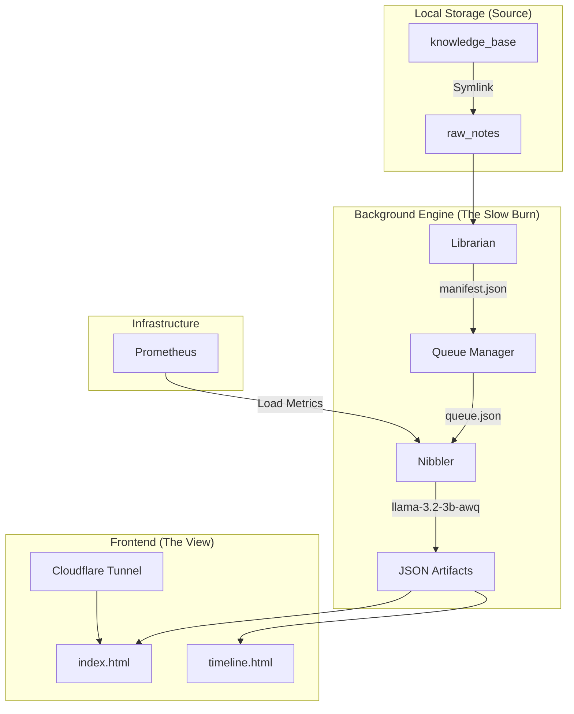

# Field Notes Architecture Overview

This document provides a high-level technical map of the Field Notes portfolio system.

## 🛰️ System Topology


```mermaid
graph TD
    subgraph "Local Storage (Source)"
        A[knowledge_base] -->|Symlink| B[raw_notes]
    end

    subgraph "Background Engine (The Slow Burn)"
        B --> C[Librarian]
        C -->|manifest.json| D[Queue Manager]
        D -->|queue.json| E[Nibbler]
        E -->|llama-3.2-3b-awq| F[JSON Artifacts]
    end

    subgraph "Infrastructure"
        G[Prometheus] -->|Load Metrics| E
    end

    subgraph "Frontend (The View)"
        F --> H[index.html]
        F --> I[timeline.html]
        J[Cloudflare Tunnel] --> H
    end
```

## 🛠️ Component Breakdown

### 1. Data Ingestion
- **`scan_librarian.py`**: Reads first/middle 1KB of files. Pinky classifies type (`LOG`, `REFERENCE`, `META`).
- **`scan_queue.py`**: Splits `LOG` files into monthly chunks. Uses MD5 hashing to skip unchanged data.

### 2. Processing (The Nibbler)
- **`nibble.py`**: The atomic unit of work. 
    - Queries Prometheus for `node_load1`.
    - If `load < 2.0`, fetches 1 task from `queue.json`.
    - Asks Pinky to extract technical wins + redact names.
    - Saves granular JSON and updates Yearly Aggregate.
- **`force_feed.py`**: Batch wrapper to loop the nibbler until the queue is empty.

### 3. The "Neural Uplink" (Static API)
- Data lives in `field_notes/data/`.
- `themes.json`: Mapping of years to strategic focal goals.
- `YYYY.json`: Collection of all monthly events for a given year.
- `status.json`: Heartbeat file showing last scan result and total record count.

### 4. User Interface
- **`timeline.html`**: A "Class 1" (Vanilla JS) SPA.
    - Uses `IntersectionObserver` for scroll-aware priming.
    - Uses an accordion-tree structure for "Operating System" feel.
    - Features a high-speed character buffer (Typewriter) for log display.
- **Fail-Safe Mechanism**: The UI includes hardcoded 2005-2024 skeletons. If the network fetch fails, the tree still populates.

## 🧠 The Resonant Chamber (Bicameral Flow)
The system uses an "Overhearing" pattern where nodes are aware of the Lab's strategic intent before generating responses.

```mermaid
sequence_sequence_diagram
    participant U as User
    participant H as Lab Hub (acme_lab.py)
    participant L as Lab Actor (Sentinel)
    participant P as Pinky (Foil)
    participant B as Brain (Sovereign)

    U->>H: Query: "What happened in 2019?"
    H->>L: situational_audit(query, vitals)
    L-->>H: [SITUATION: RECALL][SENTIMENT: STRATEGIC]
    H->>B: prime_strategic_signal(RECALL)
    B-->>H: [SIGNAL: ARCHIVE_SEARCH_INITIATED]
    
    Note over H,P: Resonant Chamber: Hub injects B's Signal into P's context
    H->>P: facilitate(query, context: "[STRATEGIC_INTENT: ARCHIVE_SEARCH]")
    H->>B: deep_think(query, context: "RAW_ARCHIVE_DATA")
    
    P-->>U: [REFLEX]: "Narf! Let me find those 2019 gems..."
    B-->>U: [INSIGHT]: "Derivation of 2019 events..."
    
    Note over P: Pinky summarizes the final turn
    P-->>U: [WRAP-UP]: "So that's why 2019 was a pivot year!"
```

## 🔐 Access Control Layer (BKM Pointer)
# GOAL: Enable Cloudflare "Access Requests" (The "Knock" button) for Guest Entry
# KEYWORD: Set `approval_required: true` (The "Beta" Click equivalent)
# SCOPE: Application Policy (Precedence > 1)
# LOGIC: Create a catch-all policy that prompts for justification and emails the admin.
# PAYLOAD_CONFIG:
```json
{
  "name": "Access Request Knock",
  "decision": "allow",
  "precedence": 2,
  "include": [{ "everyone": {} }],
  "approval_required": true,
  "approval_groups": [{ "email_addresses": ["admin@example.com"] }],
  "purpose_justification_required": true,
  "purpose_justification_prompt": "Please verify your identity."
}
```
# AUTH: Requires `Account: Cloudflare Zero Trust: Edit` (Token must be upgraded).

## ⚠️ Known Fragilities & Fixes
- **Mobile Caching:** Browsers are aggressive. Use versioned URLs (`?v=X.X`) for all CSS/JS changes.
- **JSON Formatting:** Large prompts occasionally cause LLM hallucinations. The `nibble.py` script includes a `validate_date` and `extract_json_from_llm` cleanup layer.

## 🛠️ Future Tooling: The Agentic Editor
*Retrospective on CLI Capabilities (Jan 2026)*

The current development workflow relies on `replace` (exact string matching) and `write_file` (full rewrite). This creates a "Chopstick Coding" friction where minor edits fail due to whitespace mismatches, forcing risky full-file overwrites.

**Proposal: `apply_patch` Tool**
To move from "Chopsticks" to "Tweezers," the CLI tool belt should be upgraded with a patch application utility.

*   **Format:** Standard Unified Diff (git diff) or Aider-style Search/Replace blocks (`<<<<<<< SEARCH ... ======= ... >>>>>>> REPLACE`).
*   **Benefit:**
    *   **Fuzzy Context:** Matches code even if line numbers shift or comments change slightly.
    *   **Safety:** Reduces the risk of "file clobbering" inherent in `write_file`.
    *   **Efficiency:** Consumes fewer tokens than re-sending the entire file content.
