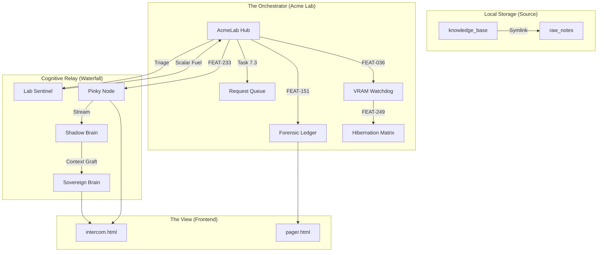
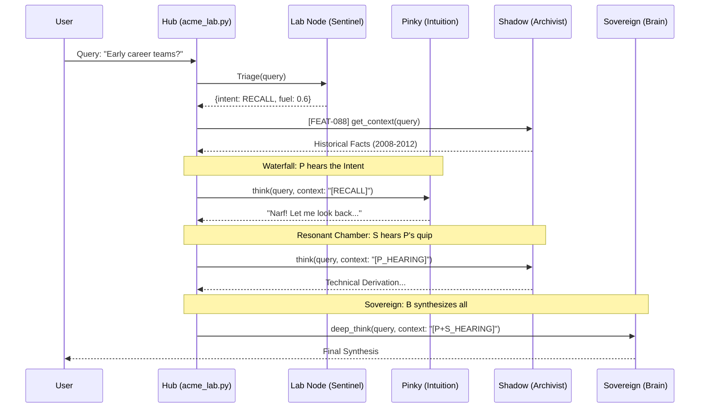

# Field Notes Architecture Overview

This document provides a high-level technical map of the Field Notes portfolio system.

## 🛰️ System Topology


```mermaid
graph TD
    subgraph "Local Storage (Source)"
        A[knowledge_base] -->|Symlink| B[raw_notes]
    end

    subgraph "The Orchestrator (Acme Lab)"
        H[AcmeLab Hub] -->|Task 7.3| Q[Request Queue]
        H -->|FEAT-151| FL[Forensic Ledger]
        H -->|FEAT-036| WD[VRAM Watchdog]
        WD -->|FEAT-249| HM[Hibernation Matrix]
    end

    subgraph "Cognitive Relay (Waterfall)"
        H -->|Triage| L[Lab Sentinel]
        L -->|Scalar Fuel| H
        H -->|FEAT-233| P[Pinky Node]
        P -->|Stream| S[Shadow Brain]
        S -->|Context Graft| SB[Sovereign Brain]
    end

    subgraph "The View (Frontend)"
        SB --> IC[intercom.html]
        P --> IC
        FL --> PG[pager.html]
    end
```

## 🛠️ Component Breakdown

### 1. Data Ingestion & Indexing
- **`scan_librarian.py`**: Heuristic classification of raw notes (`LOG`, `META`, `REF`).
- **`archive_node.py`**: [FEAT-088] Semantic RAG engine using ChromaDB for discovery and filesystem for acquisition.

### 2. The Neural Relay (Cascading Spark)
- **`AcmeLab` (acme_lab.py)**: Physical manager of silicon ports, hibernation states, and the request queue.
- **`CognitiveHub` (cognitive_hub.py)**: The logical Corpus Callosum. 
    - **Triage**: Uses the Lab Sentinel to calculate **Scalar Fuel** [FEAT-234].
    - **Bicameral Airtime**: [FEAT-207] Manages the "Silicon Gap" with inter-node fillers and overhearing to prevent "Brain Silence."
    - **Foil-Aware Memory**: [FEAT-356] Persistent short-term context (deque) giving Pinky a view of the Brain's logic.
    - **Waterfall**: [FEAT-233] Streams Pinky's intuition directly into Shadow's context window.
    - **Fidelity Gate**: Autonomously triggers backtracking if RAG context is thin.

### 3. VRAM Governance & Evolution
- **`Hibernation Matrix`**: [FEAT-249] Tiered reclamation based on 10m idle window.
- **`Resilience Ladder`**: Graceful downshifting under VRAM pressure.
- **`Pedigree Refinement`**: [FEAT-160] Background LoRA training pipeline that physically encodes history into model weights.

### 4. User Interface
- **`intercom.html`**: [VIBE-013] Sequential Blending. Displays the multi-node reasoning waterfall.
- **`pager.html`**: High-fidelity terminal view for the **Forensic Ledger** alerts.

## 🧠 The Resonant Chamber (Waterfall Flow)
The system uses an "Overhearing" pattern where nodes are aware of the Lab's strategic intent before generating responses.


```mermaid
sequenceDiagram
    participant U as User
    participant H as Hub (acme_lab.py)
    participant L as Lab Node (Sentinel)
    participant P as Pinky (Intuition)
    participant S as Shadow (Archivist)
    participant B as Sovereign (Brain)

    U->>H: Query: "Early career teams?"
    H->>L: Triage(query)
    L-->>H: {intent: RECALL, fuel: 0.6}
    
    H->>S: [FEAT-088] get_context(query)
    S-->>H: Historical Facts (2008-2012)
    
    Note over H,P: Waterfall: P hears the Intent
    H->>P: think(query, context: "[RECALL]")
    P-->>H: "Narf! Let me look back..."
    
    Note over H,S: Resonant Chamber: S hears P's quip
    H->>S: think(query, context: "[P_HEARING]")
    S-->>H: Technical Derivation...
    
    Note over H,B: Sovereign: B synthesizes all
    H->>B: deep_think(query, context: "[P+S_HEARING]")
    B-->>U: Final Synthesis
```

## 🔐 Access Control Layer (BKM Pointer)
# GOAL: Enable Cloudflare "Access Requests" (The "Knock" button) for Guest Entry
# KEYWORD: Set `approval_required: true` (The "Beta" Click equivalent)
# SCOPE: Application Policy (Precedence > 1)
# LOGIC: Create a catch-all policy that prompts for justification and emails the admin.
# PAYLOAD_CONFIG:
```json
{
  "name": "Access Request Knock",
  "decision": "allow",
  "precedence": 2,
  "include": [{ "everyone": {} }],
  "approval_required": true,
  "approval_groups": [{ "email_addresses": ["admin@example.com"] }],
  "purpose_justification_required": true,
  "purpose_justification_prompt": "Please verify your identity."
}
```
# AUTH: Requires `Account: Cloudflare Zero Trust: Edit` (Token must be upgraded).

## ⚠️ Known Fragilities & Fixes
- **Mobile Caching:** Browsers are aggressive. Use versioned URLs (`?v=X.X`) for all CSS/JS changes.
- **JSON Formatting:** Large prompts occasionally cause LLM hallucinations. The `nibble.py` script includes a `validate_date` and `extract_json_from_llm` cleanup layer.

## 🛠️ Future Tooling: The Agentic Editor
*Retrospective on CLI Capabilities (Jan 2026)*

The current development workflow relies on `replace` (exact string matching) and `write_file` (full rewrite). This creates a "Chopstick Coding" friction where minor edits fail due to whitespace mismatches, forcing risky full-file overwrites.

**Proposal: `apply_patch` Tool**
To move from "Chopsticks" to "Tweezers," the CLI tool belt should be upgraded with a patch application utility.

*   **Format:** Standard Unified Diff (git diff) or Aider-style Search/Replace blocks (`<<<<<<< SEARCH ... ======= ... >>>>>>> REPLACE`).
*   **Benefit:**
    *   **Fuzzy Context:** Matches code even if line numbers shift or comments change slightly.
    *   **Safety:** Reduces the risk of "file clobbering" inherent in `write_file`.
    *   **Efficiency:** Consumes fewer tokens than re-sending the entire file content.
