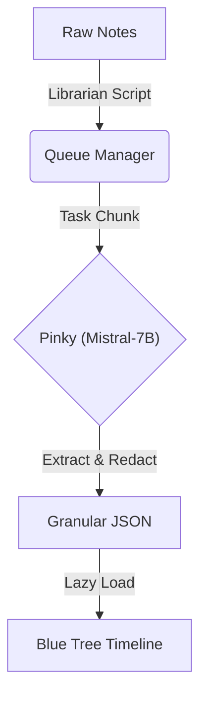

# Field Notes | Technical Portfolio

**A "Class 1" Engineering Dashboard driven by a local AI knowledge graph.**

This repository contains the source code for [notes.jason-lab.dev](https://notes.jason-lab.dev), a professional portfolio and career timeline built with a philosophy of radical simplicity and active intelligence.

---

## 🏗️ The Philosophy: "Class 1"
This project adheres to a strict "Class 1" design constraint: **Robust, self-contained, and framework-free.**
*   **No React/Vue/Angular:** Pure HTML, CSS, and Vanilla JS.
*   **No Backend Runtime:** The site runs as static files (JSON/HTML).
*   **No Build Step:** WYSIWYG. Viewable via `python3 -m http.server`.

## 🧠 The Architecture: "Static Synthesis"
While the frontend is simple, the backend is a sophisticated AI pipeline ("The Slow Burn") that indexes 18 years of raw engineering logs.



### Key Components
1.  **The Librarian (`scan_librarian.py`):** Classifies raw text files as Logs, References, or Strategic Context using AI heuristics.
2.  **The Nibbler (`nibble.py`):** A load-aware background worker that "nibbles" at the log archives every 15 minutes, extracting technical events while respecting host CPU load (via Prometheus).
3.  **Privacy Engine:** Automatically detects and redacts PII (Names/Emails) from technical logs before publishing to the static timeline.
4.  **The Timeline (`timeline.html`):** A "System Admin" style interface featuring:
    *   **Lazy Loading:** Fetches data only when years are expanded.
    *   **Typewriter FX:** Simulates a live terminal stream.
    *   **Fail-Safe:** Hardcoded skeletons ensure the site renders even if the API layer fails.

## 🚀 Usage (Maintenance)
This repo is the "Code" layer. The "Data" layer stays local.

```bash
# 1. Update Manifest (Classify new files)
python3 field_notes/scan_librarian.py

# 2. Queue Changes
python3 field_notes/scan_queue.py

# 3. Process Queue (The Slow Burn)
# Runs via systemd, or manually:
python3 field_notes/force_feed.py
```

## 🚀 Lab Deployment & Services
As part of the **Federated Lab** architecture, this repository acts as the **Platform Host** for `z87-Linux`.

### Systemd Services (Managed by z87-Linux)
These services ensure the platform is always available:
*   `cloudflared.service`: Connects `jason-lab.dev` to the local machine.
*   `code-server@jallred.service`: VS Code Web IDE (`code.jason-lab.dev`).
*   `acme-pager.service`: Streamlit Log/Note Pager (`pager.jason-lab.dev`).
*   `acme-notes.service`: Static Timeline Server (`notes.jason-lab.dev`).

### Local Environment
*   **Path:** `~/Dev_Lab/Portfolio_Dev`
*   **Data Source:** `raw_notes/` (Symlink to `~/knowledge_base`)
*   **Backend Link:** `HomeLabAI_Dev/` (Symlink to `~/Dev_Lab/HomeLabAI`)

## 🤖 Credits & Collaboration
This project was architected and implemented in an agentic loop with **Google Gemini CLI**.
*   **Concept & Strategy:** Jason Allred
*   **Code & Integration:** Gemini CLI (Agent)
*   **Indexing Engine:** "Pinky" (Local Mistral-7B)

---
*Status: Live & Operational.*
