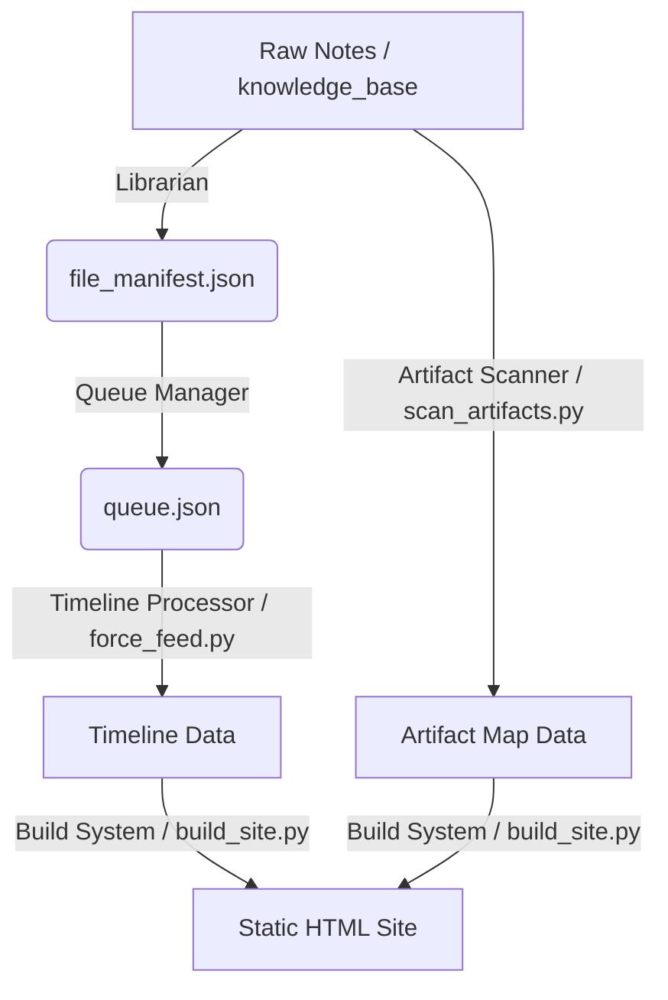

# Technical Portfolio: Field Notes

**A zero-dependency static engineering dashboard built from 18 years of technical logs.**

This repository contains the source code for [notes.jason-lab.dev](https://notes.jason-lab.dev), a professional portfolio and career environment built with a focus on simplicity, native web standards, and static generation.

---

## 🌐 Live Showcase
**[https://notes.jason-lab.dev](https://notes.jason-lab.dev)**
*An interactive demo of the dashboard, including the Career Timeline and Artifact Map.*

---

## 🏗️ The Philosophy: Zero-Framework Native Architecture
This project adheres to a strict design constraint ensuring the platform is robust, self-contained, and run-anywhere:
*   **No Frameworks (No React/Vue/Angular):** Pure HTML5, modern vanilla CSS, and standard ES modules (such as custom Web Components).
*   **Serverless & Static:** The site runs completely as static files, utilizing lazy-loaded JSON payloads for dynamic search indexing.
*   **Zero-Dependency Runtime:** Viewable instantly in any browser. Local preview requires only a basic static web server (e.g., `python3 -m http.server`).

---

## 🧠 The Architecture: Static Synthesis
The backend is a static generation pipeline that indexes 18 years of raw engineering logs into a static knowledge graph. It uses a dual-component system (local and remote) to analyze and structure the data.

*   **Dual-Component Coordination:** Local and remote components collaborate to structure the log archive into structured JSON payloads.
*   **Static Availability:** The portfolio serves as the static representation of a distributed research environment.
*   **Historical Data Encoding:** Uses LoRA adapters to encode 18-year technical histories for structured recall.
*   **Component Interaction:** Local and remote components interact to validate and structure the data during refinement cycles.


```mermaid
graph TD
    A[Raw Notes / knowledge_base] -->|Librarian| B(file_manifest.json)
    B -->|Queue Manager| C(queue.json)
    C -->|Timeline Processor / force_feed.py| D[Timeline Data]
    A -->|Artifact Scanner / scan_artifacts.py| E[Artifact Map Data]
    D & E -->|Build System / build_site.py| F[Static HTML Site]
```

### Core Architecture Components
1.  **The Librarian (`scan_librarian.py`):** Classifies raw text files in the `knowledge_base` into type categories (Logs, References, or Strategic Context) and builds the file manifest.
2.  **Timeline Processor (`nibble.py`):** A background worker for the **Timeline**. It processes log archives in month/year chunks, sending them to the local LLM endpoint to extract technical events and redact private info.
3.  **The Curator (`scan_artifacts.py`):** A specialized scanner for the **Artifact Map**. It analyzes files (PDFs, Scripts, Decks) to assign a "Showcase Rank" (0-4) and synopsis. High-value items ("4-Star") are hardcoded with expert descriptions and direct links.
4.  **The Dashboard (`index.html`, `timeline.html`, `files.html`):** A "System Admin" style interface featuring persistent navigation components (using custom Web Components), content-aware search filtering, and custom terminal animation effects.

---

## 🚀 Usage & Site Compilation

### Primary Developer Commands

```bash
# 1. Compile and Rebuild the Static Templates
# Recompiles Protocols.md, RESEARCH_SYNTHESIS.md, and FeatureTracker.md into HTML templates,
# runs model benchmarks, and updates cache-busting hashes on static assets.
python3 field_notes/build_site.py

# 2. Aggressively Run the Backlog Synthesis Loop
# Automates the entire timeline processing sequence (Librarian -> Queue Manager -> Nibbler loop).
python3 field_notes/force_feed.py

# 3. Rebuild the Showcase Artifact Map
# Re-scans project directories to refresh rankings, descriptions, and file locations.
python3 field_notes/scan_artifacts.py ALL
```

### Granular Maintenance Commands

```bash
# Update File Classifications (Manifest)
python3 field_notes/scan_librarian.py

# Split and Queue Changed Log Chunks
python3 field_notes/scan_queue.py

# Run a Single Queue Item Processing Step (Nibbler)
python3 field_notes/nibble.py

# Clean Artifact Data Cache
python3 field_notes/clean_artifacts.py
```

---

## 🚀 Lab Deployment & Services
As part of the **Federated Lab** architecture, this repository acts as the **Platform Host** for `z87-Linux`.

### Systemd Services (Managed by z87-Linux)
These services ensure the platform is always available:
*   `cloudflared.service`: Connects `jason-lab.dev` to the local machine.
*   `code-server@jallred.service`: VS Code Web IDE (`code.jason-lab.dev`).
*   `acme-pager.service`: Streamlit Log/Note Pager (`pager.jason-lab.dev`).
*   `field-notes.service`: Static Timeline Server (`notes.jason-lab.dev` / serves port 9001).

### Local Environment
*   **Path:** `~/Dev_Lab/Portfolio_Dev`
*   **Data Source:** `raw_notes/` (Symlink to `~/knowledge_base`)
*   **Backend Link:** `HomeLabAI_Dev/` (Symlink to `~/Dev_Lab/HomeLabAI`)

---

## 🤖 Credits & Collaboration
This project was developed with assistance from **Google Gemini CLI**.
*   **Concept & Strategy:** Jason Allred
*   **Code & Integration:** Gemini CLI (Agent)
*   **Indexing Engine:** Dual-Component System (Local + Remote)

---
*Status: Live & Operational.*