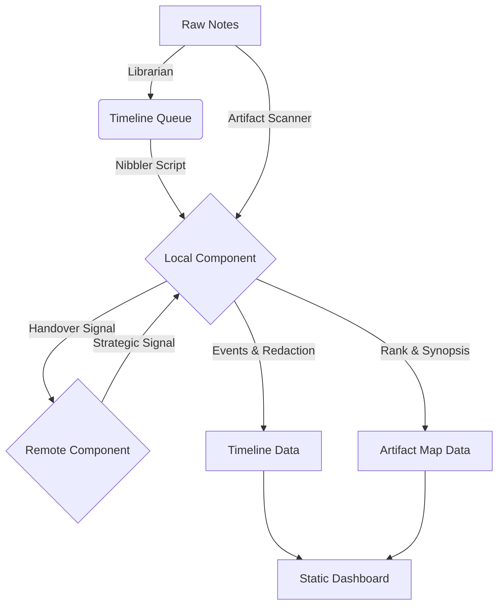

# Technical Portfolio: Field Notes

**A static engineering dashboard built from 18 years of technical logs.**

This repository contains the source code for [notes.jason-lab.dev](https://notes.jason-lab.dev), a professional portfolio and career environment built with a focus on simplicity and static generation.

---

## 🌐 Live Showcase
**[https://notes.jason-lab.dev](https://notes.jason-lab.dev)**
*An interactive demo of the dashboard, including the Career Timeline and Artifact Map.*

---

## 🏗️ The Philosophy: "Class 1"
This project adheres to a strict "Class 1" design constraint: **Robust, self-contained, and framework-free.**
*   **No React/Vue/Angular:** Pure HTML, CSS, and Vanilla JS.
*   **No Backend Runtime:** The site runs as static files (JSON/HTML).
*   **No Build Step:** WYSIWYG. Viewable via `python3 -m http.server`.

## 🧠 The Architecture: Static Synthesis
The backend is a static generation pipeline that indexes 18 years of raw engineering logs into a knowledge graph (JSON/HTML). It uses a dual-component system (local and remote) to analyze and structure the data.

*   **Dual-Component Coordination:** Local and remote components collaborate to structure the 18-year archive into data.
*   **Static Availability:** The portfolio is a static representation of a distributed environment.
*   **Historical Data Encoding:** Uses LoRA adapters to encode 18 years of technical history for structured recall.
*   **Component Interaction:** Local and remote components interact to refine and structure data.


```mermaid
graph TD
    A[Raw Notes] -->|Librarian| B(Timeline Queue)
    B -->|Nibbler Script| C{"Local Component"}
    A -->|Artifact Scanner| C
    C -->|Handover Signal| G{"Remote Component"}
    G -->|Strategic Signal| C
    C -->|Events & Redaction| D[Timeline Data]
    C -->|Rank & Synopsis| E[Artifact Map Data]
    D & E --> F[Static Dashboard]
```

### Key Components
1.  **The Librarian (`scan_librarian.py`):** Classifies raw text files as Logs, References, or Strategic Context using heuristics.
2.  **Timeline Processor (`nibble.py`):** A background worker that processes log archives in chunks to extract technical events and redact PII.
3.  **The Curator (`scan_artifacts.py`):** A specialized scanner for the **Artifact Map**. It analyzes files (PDFs, Scripts, Decks) to assign a "Showcase Rank" (0-4) and synopsis. High-value items ("4-Star") are hardcoded with expert descriptions and direct links.
4.  **The Dashboard (`index.html`, `timeline.html`, `files.html`):** A "System Admin" style interface featuring:
    *   **Persistent Navigation:** "Mission Control" links remain visible during searches.
    *   **Content-Aware Search:** Filters matches sidebar titles, index keys, and story body text.
    *   **Terminal Animation:** Simulates a terminal output for timeline events.

## 🚀 Usage (Maintenance)
This repo is the "Code" layer. The "Data" layer stays local.

```bash
# 1. Update Manifest (Classify new files)
python3 field_notes/scan_librarian.py

# 2. Queue Changes
python3 field_notes/scan_queue.py

# 3. Process Timeline (The Slow Burn)
python3 field_notes/force_feed.py

# 4. Refresh Artifact Map
python3 field_notes/scan_artifacts.py ALL

# 5. Clean Artifact Data (Reset)
python3 field_notes/clean_artifacts.py
```

## 🚀 Lab Deployment & Services
As part of the **Federated Lab** architecture, this repository acts as the **Platform Host** for `z87-Linux`.

### Systemd Services (Managed by z87-Linux)
These services ensure the platform is always available:
*   `cloudflared.service`: Connects `jason-lab.dev` to the local machine.
*   `code-server@jallred.service`: VS Code Web IDE (`code.jason-lab.dev`).
*   `acme-pager.service`: Streamlit Log/Note Pager (`pager.jason-lab.dev`).
*   `acme-notes.service`: Static Timeline Server (`notes.jason-lab.dev`).

### Local Environment
*   **Path:** `~/Dev_Lab/Portfolio_Dev`
*   **Data Source:** `raw_notes/` (Symlink to `~/knowledge_base`)
*   **Backend Link:** `HomeLabAI_Dev/` (Symlink to `~/Dev_Lab/HomeLabAI`)

## 🤖 Credits & Collaboration
This project was developed with assistance from **Google Gemini CLI**.
*   **Concept & Strategy:** Jason Allred
*   **Code & Integration:** Gemini CLI (Agent)
*   **Indexing Engine:** Dual-Component System (Local + Remote)

---
*Status: Live & Operational.*