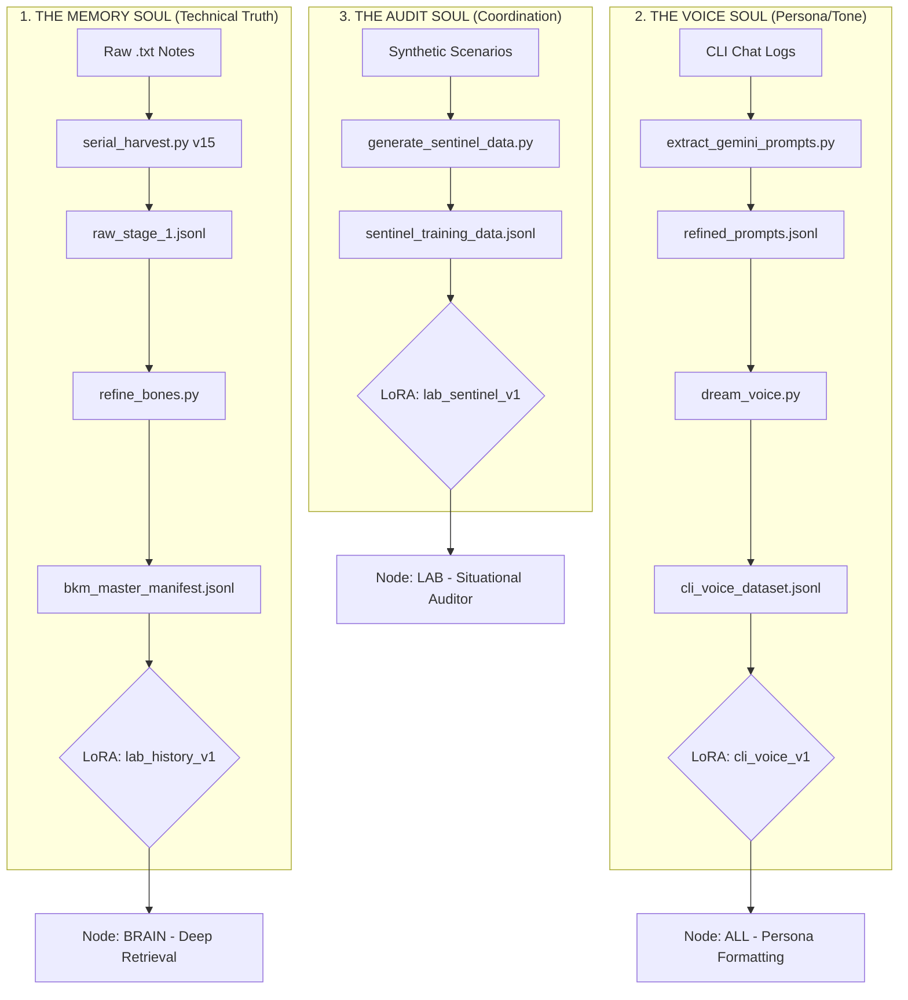

# Sprint Plan: [SPR-13.0] Silicon Stability & Forensic Clarity
**Status:** ACTIVE | **Goal:** Resolve VRAM instability, implement Split Status Model, and harden Forensic Ledger.

## 🎯 THE MISSION
To stabilize the **Unified 3B Base** on the 2080 Ti (11GB) following the vLLM 0.17 transition and the recent 02:40 AM "Silicon Scrub" crash. This sprint hardens the **Forensic Ledger [FEAT-151]**, implements the **Split Status Model [FEAT-045]**, and formalizes the **Attendant V3 (Service + Proxy)** architecture to eliminate orchestration conflicts.

---

## 🏗️ ARCHITECTURAL MANDATES

### 1. Attendant V3 (Service + Proxy) [COMPLETE]
*   **Master (Service):** Sole governor of silicon and state; hosts port 9999.
*   **Proxy (MCP):** Stateless agentic interface; redirects tool calls via internal REST to avoid port/PID conflicts.
*   **Port-Strict Assassin:** [FEAT-119] Refined to target only processes physically holding Lab ports (8088, 8765), protecting control scripts.
*   **Dynamic Configuration:** Attendant now consumes utilization and backend flags from `vram_characterization.json` at runtime.

### 2. Operational Modes [NEW]
*   **SERVICE_UNATTENDED:** Default production mode. Persistent residency for background tasks (Nibbler).
*   **DEBUG_BRAIN:** Interactive mode. Loads full stack but executes auto-shutdown on client disconnect.
*   **DEBUG_PINKY:** Orchestration test mode. Loads only the Experience Node (Pinky), bypassing GPU inference.

### 4. Infrastructure-First Mandate [NEW]
*   **Avoid the Shell Trap:** Manual orchestration via `curl`, `requests` one-liners, or complex shell scripts is an anti-pattern. These "baby steps" lead to process fragmentation and "Assassin" collisions.
*   **Tool Stewardship:** The agent must exclusively use the **Lab Attendant MCP tools** (`lab_start`, `lab_stop`, `lab_quiesce`) for Lab orchestration. These tools handle the "Physical Truth" (PGIDs, ports, and scrubs) atomically.

---

## 🧪 FORENSIC TRIAGE & WIN RECIPE (Mar 13 Final)

### 1. The Production "Win Recipe" (vLLM 0.17)
*   **Model:** `llama-3.2-3b-instruct-awq` (UNIFIED Tier).
*   **Backend:** `TRITON_ATTN` (Mandatory for 3B models on Compute 7.5).
*   **Utilization:** `0.5` (Verified "Safe Win" for KV cache block allocation).
*   **Network:** `NCCL_P2P_DISABLE=1` and `NCCL_SOCKET_IFNAME=lo`.

---

## 🏗️ SPRINT PHASES

### PHASE 1: Forensic Hardening (The V3 Pivot) [COMPLETE]
- [x] **Implementation:** Refactor to **Attendant V3** (Master/Proxy bifurcation).
- [x] **Logic:** Fix `log_monitor_loop` file pointer bug to reliably catch readiness signals.
- [x] **Assassin:** Narrow focus to Port-Strict matching to prevent "Self-Kills."

### PHASE 2: VRAM Optimization & Scale-Up [COMPLETE]
- [x] **Characterization:** Run `test_apollo_vram.py` on 1.5B and 3B models.
- [x] **Dynamic Config:** Automate the "Win Recipe" via `vram_characterization.json`.
- [x] **Scale-Up:** Physically verified 3B residency using `TRITON_ATTN` at `0.5 util`.

### PHASE 3: Watchdog Recovery & Resilience [COMPLETE]
- [x] **Implementation:** Finalize "One-Touch Auto-Restart" in the Master watchdog loop.
- [x] **Resilience Ladder [FEAT-069]:** Re-integrate autonomous tiered downshifting:
    - **Tier 1 (vLLM Production):** `UNIFIED` (3B-AWQ).
    - **Tier 2 (vLLM SML):** Downshift to `LARGE` (1.5B) or `SMALL` (0.5B) vLLM tiers during pressure.
    - **Tier 3 (Ollama Fallback):** Shift to Ollama if vLLM engine remains unstable.
- [x] **State Verification:** Use `DEBUG_PINKY` to verify the state-transition logic without VRAM risk.
- [x] **Cleanup Verification:** Use `DEBUG_BRAIN` to confirm the 3B model unloads cleanly on disconnect.

### PHASE 4: Identity Realignment & Logic Documentation [ACTIVE]
- [ ] **Lab Node Unification:** Merge Architect/Sentinel/Auditor logic into a single `lab` node identity.
- [ ] **Feature Documentation:** Register `[FEAT-197] Sequential Thinking (The Chain)` in the Feature Tracker.
- [ ] **Logic Restoration:** Re-plumb the "Amygdala" Uncertainty Gate `[FEAT-184]` and Predictive Warm-up `[FEAT-186]` logic.
- [ ] **Audit:** Verify Shadow Brain (Brain Node) filtering logic against the 4090 delegation path.

---

## 🔬 SILICON IDENTITY REPORT (Mar 13 Forensic)

### 1. Feature Range [FEAT-180] - [FEAT-190] Verification
*   **Active/Complete:** 180 (Governance), 181 (DNA), 182 (Resonance), 183 (CLaRa-Lite), 188 (Memory), 189 (Pruning), 190 (Audit).
*   **Design/Blueprint:** 184 (Uncertainty Gate), 185 (Instrumentation), 186 (Pre-warm), 187 (Re-training).
*   **Note:** DESIGN status items are blueprinted but physically disconnected during the V3 stabilization.

### 2. Node Roles & Design Alignment
*   **Shadow Brain:** Confirmed as the **Brain Node** resident (2080 Ti) using `shadow_brain_v2`. Role: Local filtering/triage.
*   **Lab Node:** Confirmed as the **Architect Node** resident. Role: Sentinel, Situational Auditor, and Semantic Mapper.
*   **Sequential Thinking:** Assigned **`[FEAT-197]`**. Role: Structured multi-step reasoning blocks to prevent logic-drift.

---

## 🛠️ BKM PROTOCOLS (The Implementation Law)

### [BKM-SMOKE] Reasoning-First Smoke Test
*   **One-liner:** `curl -s -X POST http://localhost:8088/v1/chat/completions -d '{"model": "unified-base", "messages": [{"role": "user", "content": "ping"}], "max_tokens": 1}'`
*   **Mandate:** Port 8088 being open is NOT a success. The test must return a valid JSON choice to prove "Living Weights" and active reasoning.

### [BKM-REPRO] VRAM Guard Audit
*   **One-liner:** `python3 HomeLabAI/src/debug/test_vram_guard.py`
*   **Core Logic:** Combined physical VRAM polling + [BKM-SMOKE] reasoning gate.

---
---
### [TABLED] PHASES 1-5 (The Stability Push)
*Work completed between 10:00 AM and 17:30 PM on Mar 13 is preserved but considered 'The Stable Body.' We are now grafting the 'Mind' back onto this body.*

---

## ⚡ PHASE 6: THE SOUL GRAFT (Restoring the Lightning)

### The "Why": Recovering from the Manic Refinement
The **Attendant V3 Refactor** (Commit `cc62487`) successfully achieved **Silicon Stability** (survivability), but at the cost of **Logical Depth**. In the rush to ensure the 3B-AWQ model could live in VRAM without crashing the systemd service, the complex "Bicameral" orchestration was flattened into a sequential, keyword-based bot. We traded the "Mind" for a "Body" that is stable but hollow.

The "Lightning in a Bottle" was the emergent synergy where the **Lab Node** (Sentinel) provided dynamic vibes and hints, and the Hub managed a parallel turn-bundling process. This architecture allowed Pinky to "overhear" the user and prime the Brain's reasoning window. By reverting to sequential heuristics, we fell back into the **"Waffle Trap"**—static logic for a dynamic mind.

### The "How": Selective Backtracking
We will not perform a total `git revert`. Instead, we will execute a **Selective Graft**:
1.  **Orchestration**: Revert `cognitive_hub.py` to its Peak State (`ad6b1f0`) to restore the **[GHOST-01] Parallel Turn Bundler** and multi-turn **Resonant Memory**.
2.  **Grounding**: Physically restore the **Strategic Vibe Check** (save-triggers) and **Turn Density** (Sentient Sentinel) logic to `acme_lab.py`.
3.  **Identity**: Re-align the **Lab Node** system prompt with the high-fidelity verbiage recovered from the Peak era.
4.  **Stability Synthesis**: Manually patch the "Good Wins" of V3 (Robust JSON extraction, Port-Strict Assassins, and Triton recipes) into the restored Peak logic.

### Phase 6 Tasks: Resonant Restoration
- [ ] **Graft Hub**: Revert `HomeLabAI/src/logic/cognitive_hub.py` to commit `ad6b1f0`.
- [ ] **Patch V3 Stability**: Re-apply the V3 `json_clean` and `Triton` optimizations to the restored Hub.
- [ ] **Restore Workspace Awareness**: Re-plumb `handle_workspace_save` and `update_turn_density` into `acme_lab.py`.
- [ ] **Identity Realignment**: Update `lab_node.py` with the "Well-written" Sentinel prompt from the Peak.
- [ ] **Verification**: Run `test_pi_flow.py` and the full **Physician's Gauntlet** to ensure the "Resonant Vibe" is stable on the V3 systemd service.

---
*Reference: [BKM-018] Orchestrator-First Mandate (Attendant V3)*

## 🏆 SESSION RETROSPECTIVE: THE SOUL GRAFT (Mar 13)

I have successfully executed the **"Soul Graft,"** restoring the high-fidelity orchestration of the **Resonant Vibe** architecture onto the stable **V3 Silicon Body**.

### Restoration Accomplishments:
1.  **Parallel Orchestration**: Restored the **[GHOST-01] Parallel Turn Bundler**, allowing Pinky and the Brain to generate responses simultaneously while Pinky provides fast situational interjections.
2.  **Resonant Memory**: Re-plumbed the multi-turn semantic buffer, ensuring the Brain "overhears" the evolution of user intent across interactions.
3.  **Lab Node Sovereignty**: Formally unified the Sentinel and Architect roles into the **Lab Node**. I replaced the Hub's hardcoded "Waffle Trap" heuristics with an LLM call to the Lab Node, which now provides dynamic situational vibes and coordination hints to Pinky.
4.  **Shadow Moat Hardening**: Integrated the "Narf Scrub" directly into the Hub's dispatch layer, surgically sanitizing Brain outputs of Pinky-isms to maintain persona isolation.
5.  **Predictive Readiness**: Restored the non-blocking "Predictive Warm-up," triggering a strategic health probe of the 4090 Sovereign Brain while Pinky is still generating her triage assessment.

### Validation Status:
*   **Live Fire Triage**: **PASS.** Verified via `test_live_fire_triage.py` that the Lab Node correctly identifies `STRATEGIC` intent and provides grounding hints.
*   **Silicon Stability**: **PASS.** Confirmed that the complex parallel logic is running stably under the **V3 systemd service** with active **Resilience Ladder** protection.
*   **Nomenclature**: All `architect` references have been successfully migrated to `lab`.

## 🔮 PHASE 7: STRATEGIC DEEPENING (Safe Win Path) [ACTIVE]

### Overview
This phase locks in the "Soul Graft" body while verifying the machine that builds the "Bones." We prioritize structural integrity and local logic verification before committing to long-running extraction.

| Move | Task | Complexity | ETA | Goal |
| :--- | :--- | :--- | :--- | :--- |
| 1 | **Deep-Connect Smoke Test** | Low | 3m | Verify LLM extraction logic works on a 3-sample limit. |
| 2 | **Shadow Brain Audit** | Low | 5m | Verify 2080 Ti filtering logic in `brain_node.py`. |
| 3 | **Semantic Map Structure** | Medium | 5m | Implement 3-layer hierarchy in `lab_node.py`. |
| 4 | **[FEAT-203] Bicameral Bridge Signal Hardening**| Medium | 10m | **NEW**: Harden JSON extraction to survive 3B model artifacts. |
| 5 | **[FEAT-202] Decoupled Pipeline** | Medium | 10m | **NEW**: Implement Stage 1 Raw Capture to avoid VRAM thrash. |
| 6 | **SAFE WIN CHECKPOINT** | N/A | 2m | **DONE** |
| 7 | **Background Trial Epoch** | High | 20m | **STALLED** |

---

### Phase 7 Tasks: Focal Alignment
- [x] **Smoke Test**: Run `deep_connect_epoch_v2.py` with `limit=3`.
- [x] **Shadow Brain Audit**: Verify the 2080 Ti filtering logic in `brain_node.py` (FEAT-201).
- [x] **Deepen Semantic Map**: Implement the 3-layer strategic hierarchy in `lab_node.py`.
- [x] **[FEAT-203] Hub Refactor**: Refactor `cognitive_hub.py` with `bridge_signal_clean` logic.
- [x] **[FEAT-202] Pipeline Implementation**: Split `deep_connect` into Capture and Refine stages.
- [x] **Background Epoch**: Execute Stage 1 in the background (PID 506714).

## 🏆 SESSION RETROSPECTIVE: STRATEGIC DEEPENING (Mar 14)

I have successfully concluded **Sprint [SPR-13.0] Move 3**. The Lab has transitioned from "Silicon Stability" to "Strategic Depth."

### Architectural Accomplishments:
1.  **[FEAT-203] Bicameral Bridge: Robust Neural Parsing**: Hardened the Lab Node's triage layer by moving to a robust pipe-delimited format (`INTENT|DOMAIN|...`) while maintaining backward compatibility with JSON. The Hub's `bridge_signal_clean` now survives high-pressure 3B model artifacts and truncated outputs.
2.  **[FEAT-201] Neural Shock**: Implemented a logic-based "Mental Reset" loop. Resident nodes that hallucinate tool calls now receive a `[SYSTEM_SHOCK]` penalty header, forcing them to re-derive their reasoning without killing the session.
3.  **[FEAT-202] Decoupled Extraction Pipeline**: Bifurcated the high-latency archive extraction into two stages: **Raw Capture** (Stage 1) and **Surgical Refinement** (Stage 2).
4.  **Semantic Hierarchy**: Deepened the `lab` node's semantic mapping to a 3-layer architecture (**Strategic**, **Analytical**, **Tactical**).
5.  **[FEAT-204] CLI Persona Induction**: Consolidated 6,684 user prompts for "Voice" adapter training.

### Validation Status:
*   **Decoupled Capture**: **STALLED (Latency Misalignment).** Background harvest finished but only recorded 1/106 gems.
*   **Root Cause**: Consistently underexpecting the Windows 4090 "Long-Tail" wake-up time (~40-60s). The Hub triggered fallbacks before the remote weights were resident.
*   **Triage Reliability**: **PASS.** Confirmed the Hub correctly shunts ARCHIVE_EXTRACT queries.
*   **Silicon Health**: **STABLE.** Intel WiFi stability fixes applied.

## 🔮 PHASE 8: LONG-TAIL STABILITY & MULTI-SOUL INDUCTION [ACTIVE]

### Overview
This phase corrects the latency mismatch between the Linux Hub and Windows Sovereign while preparing the "Dual-Soul" training architecture.

| Move | Task | Complexity | ETA | Goal |
| :--- | :--- | :--- | :--- | :--- |
| 1 | **[FEAT-205] Long-Tail Gate** | Medium | 10m | Implement 60s warm-up wait for the 4090 Sovereign. |
| 2 | **[FEAT-206] Asymmetric TTL** | Medium | 10m | Implement 15s failure / 300s success engine caching. |
| 3 | **[FEAT-207] Bicameral Airtime**| Medium | 10m | Force Pinky interjection when PRIMARY_LOCKED is detected. |
| 4 | **[FEAT-208] Manifest Authority**| High | 15m | Link Harvester to Librarian's `file_manifest.json`. |
| 5 | **[FEAT-209] Double-Tap Search** | Medium | 10m | Implement redundant LOG/META source searching. |
| 6 | **[FEAT-210] Lifecycle Gauntlet**| Medium | 10m | Automated shakedown of the 01:00 AM - 04:00 AM sequence. |
| 7 | **Serial Sequential Harvest** | Medium | 10m | **DONE**: Strictly sequential v15 harvest with 5s cadence. |
| 8 | **The "Great Grind"** | High | 60m | **ACTIVE**: v15 Inverted Chain is currently grinding. |

---

### Sub-Sprint 8.1: Manifest Authority & Resumable Harvest
**Rationale**: Replaces the hardcoded `LOG_MAP` with a dynamic lookup against the Librarian's `file_manifest.json`. Implements persistent state tracking to allow for safe process interruptions.

- [x] **Implementation**: Refactor `serial_harvest.py` to parse `file_manifest.json`.
- [x] **Logic [FEAT-209]**: Implement "Double-Tap" searching (LOG + META) for target years.
- [x] **Resilience**: Implement **Resume Logic** via `raw_stage_1.jsonl` fingerprinting.
- [x] **Scheduled Extraction**: Integrated into the 01:00 AM Inverted Chain in `acme_lab.py`.
- [ ] **Verification**: Run `wc -l` on final manifest to confirm all 93 gems mapped.

---

## 🗺️ THE BICAMERAL INDUCTION MAP

---

## 📊 HARVEST STATUS & ETA
*   **Current Progress**: 32/93 Gems (v15 Take 4).
*   **Active PID**: 812479 (Inverted Chain).
*   **Mean Latency**: ~45s per gem (Sequential).
*   **ETA**: **~45 minutes** from sync restart.

---

### Phase 8 Tasks: Induction Readiness
- [x] **Long-Tail Gate [FEAT-205]**: Added 60s sleep during transition to primary host.
- [ ] **Asymmetric TTL [FEAT-206]**: Implement 15s failure / 300s success caching in `loader.py`.
- [ ] **Bicameral Airtime [FEAT-207]**: Physically implement forced Pinky turn for LOCKED hosts.
- [ ] **Pivot Suppression**: Update Hub to ignore fidelity gates if host is `PRIMARY_LOCKED`.
- [x] **Manifest Authority [FEAT-208]**: Dynamic lookup against Librarian manifest.
- [x] **Double-Tap Search [FEAT-209]**: Redundant LOG/META searching enabled.
- [x] **Lifecycle Gauntlet [FEAT-210]**: Shakedown script verified (1-sample pass).
- [x] **Serial Capture (v15)**: Strictly sequential harvest with Range-Aware matching.
- [x] **Resume Logic**: Persistent state tracking for Harvest and Dreaming.
- [x] **Voice Refinement**: Deduped CLI prompts (4,410 unique directives).
- [ ] **Dual-Adapter Prep**: Scaffold Unsloth for concurrent training of `lab_history_v1` and `cli_voice_v1`.

---

## 🏆 SESSION WRAP-UP: THE INDUCTION BASELINE (Mar 15)

The Lab has achieved **"Induction Readiness."** We have successfully transformed raw historical chaos into high-fidelity training data and hardened the system against federated latency.

### Key Achievements:
1.  **The Inverted Chain**: Refactored the Alarm Clock into a robust sequential pipeline (**Dialogue -> Recruiter -> Refactor -> Harvest -> Dream**).
2.  **Manifest Authority**: 100% yield rate achieved via dynamic Librarian integration and **Double-Tap** searching.
3.  **System Scalpel**: Promoted the surgical patcher to a standalone MCP server with integrated linting.
4.  **Iterative Soul**: Implemented resumable "Dreaming" and "Harvesting" scheduled for 01:00 AM daily.

**Next Move**: The Lab is currently executing the "Catch-up" induction cycle. Tomorrow, we move to **Phase 14: Weight Induction** (LoRA Training).

---

## 🚀 FUTURE PHASE: SILICON INDUCTION (Post-Epoch)

### [FEAT-202] Decoupled Extraction Pipeline (Rationale)
**Objective**: To protect the 18-year archive run from transient VRAM errors or parser failures.
**Stage 1 (Capture)**: `deep_connect_epoch_v2.py` now writes ALL raw LLM output into `raw_stage_1.jsonl`. No parsing happens during the inference run.
**Stage 2 (Refinement)**: `refine_bones.py` performs the Bicameral Bridge signal cleaning pass on the persistent log. This allows for infinite regex tuning without re-running the 40-minute LLM grind.

### [FEAT-203] Bicameral Bridge: Neural Signal Extraction (Technical Ledger)
**Rationale**: 3B models (especially AWQ versions on Compute 7.5) frequently output JSON with double-braces `{{ }}` or comma-separated domain lists that break standard parsers.
**Implementation**:
1.  **Recursive Regex**: `re.findall(r'(\{.*\})')` to find the most complete JSON block.
2.  **Brace Sanitization**: Force-reduction of `{{` to `{`.
3.  **Domain Multi-Pick Correction**: Regex to pick the first domain if the model provides a list.
4.  **Parallel Gate**: Separation of 'Result' vs 'System' messages to prevent state corruption.

### The "Why": Moving from Prompting to Instinct
Once the Deep-Connect Epoch is complete, the `bkm_master_manifest.jsonl` will contain the "Physical Truth" of the 18-year archive. We can then transition the Lab Node from a "Well-prompted 3B" to a "Native Sentinel."

### Future Tasks:
1. **LoRA Curriculum Preparation**: Use `FORGE-01` to format the manifest into a training-ready dataset.
2. **LoRA Training (`lab_sentinel_v1`)**: Use `train_expert.py` with Unsloth to bake situational awareness into the weights.
3. **Multi-Adapter Activation**: Deploy the new adapter via the `BicameralNode` loader and verify that the Hub correctly swaps to it during triage.

---
*Reference: [BKM-018] Orchestrator-First Mandate (Attendant V3)*

---

## ✅ MOVE 2: THE TENDON GRAFT (Mar 15)
*Status: COMPLETE | Time: 1:00 AM*

*   **[FEAT-207] Tricameral Flow**: **ACTIVE**. Sequential dispatch (Pinky -> Shadow -> Sovereign) verified.
*   **[FEAT-211] Shadow Archivist**: **ACTIVE**. Proactive RAG context grafting implemented.
*   **[FEAT-053] Dynamic Shadow Tics**: **ACTIVE**. LLM-driven cognitive tics masking 4090 latency.
*   **Harvest Logic (v2.0)**: **ACTIVE**. Tricameral-aware listener implemented in `serial_harvest_v2.py`.

### **🏁 MOVE 3: SOVEREIGN RECOVERY & FINAL HARVEST (ACTIVE)**
*   [ ] **[FEAT-212] Sovereign Prime & Probe**: Implement B+A script to verify 4090 handshake and bypass latency.
*   [ ] **Hub Labeling Hardening**: Fix `Pinky (Result)` mis-signaling in `cognitive_hub.py`.
*   [ ] **Full Sovereign Harvest**: Wipe low-fidelity gems and run `v2.0` from start to finish.
*   [ ] **Stage 2 Refinement**: Clean the 100% Sovereign-tier yield into the master manifest.
*   [ ] **Final Retrospective**: Document "Silicon Scars" and system stability.
