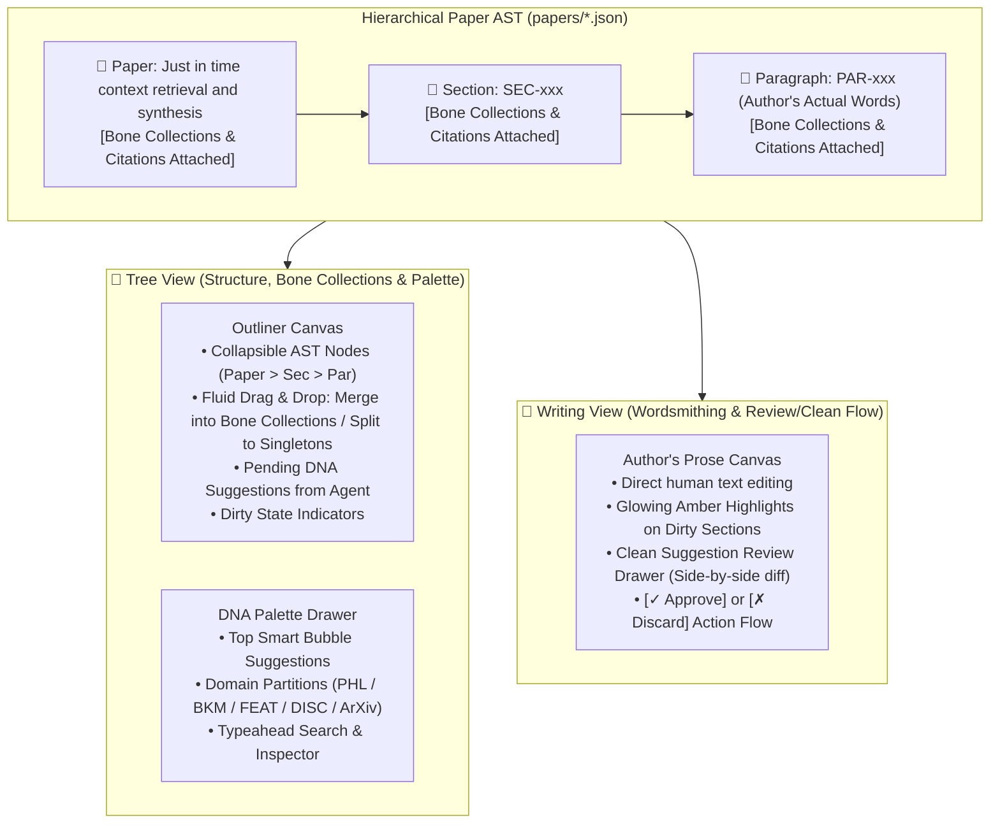

# 🚀 SPRINT PLAN 79.0: The Decoupled Thought Organizer & Wordsmithing Studio
## Sovereign Human Prose, Multi-Tier Bone Collections, Tree Outliner & Review/Clean Flow

**Sprint ID:** `SPR_79_0`  
**Theme:** Full Architectural Re-platforming of `writer.html`: Transitioning from prototype single-canvas editors to a decoupled **`[🌲 Tree View (with Palette)]`** vs. **`[🌊 Writing View]`** paradigm; establishing the **Sovereign Human Author Principle** (Author's prose is immutable; Agent only suggests connections and clean diffs); formalizing **`Bone Collections`** attached across `Paper > Section > Paragraph` tiers; adding Rename, Archive, and Gated Backdoor features; and retiring destructive cascade auto-reflow.  
**Status:** PROPOSED / READY FOR REVIEW (Alignment Solidified)  
**Parent Framework:** BKM-005 (Design Studio Alignment), BKM-020 (High-Fidelity Intent Preservation), BKM-046 (Fast-Path DNA Retrieval), BKM-024 (Live Verification), FEAT-581 (Paper Dataset Architecture & Storage), FEAT-582 (Cross-Collection DNA Citation Engine), FEAT-583 (Thought Organizer Tree & Palette), FEAT-584 (Writing View & Review/Clean Engine), FEAT-585 (Paper Schema & Invariant Guard).  
**Target Web Targets:** `Portfolio_Dev/field_notes/writer.html`, `Portfolio_Dev/scripts/build_writer.py`, `Portfolio_Dev/papers/`, `Portfolio_Dev/field_notes/data/dna_manifest.json`.  
**Target Silicon & DB:** ChromaDB Port 8001 (`philosophy_dna`, `feature_dna`, `discovery`, `sprint_dna`), Foyer REST Port 8765 (`/paper/*`).  

---

## 📜 Section 1: Internal Verbatim Origin Copy
**Source Document:** Google Doc *[Insight paper follow up ideas (9-11-2026)](https://docs.google.com/document/d/1rjtaMPnjo6rrS6adhhtyo2hw6BwwEIQyWC9ut0d6m7s/edit)* (`1rjtaMPnjo6rrS6adhhtyo2hw6BwwEIQyWC9ut0d6m7s`)  
**Author:** Jason Allred (Human Origin)

```text
Insight paper follow up ideas (9-11-2026)
New Title: Just in time context retrieval and synthesis 
Humble/Witty description: Applied armchair philosophy (risk: unprofessional)

Forgotten PHL DNA?  Did we capture  Philosophy - "Words are thoughts, don't worry about the spark of intelligence" -> if not, treat this as a clue to find where more PHL DNA is hiding 

Extra stuff: Capture non DNA info from RD. Tasks, structure, Todo. Todo-xxx?

Features to consider for removal:
LLM assisted Reflow (conflicts with direct approval MO spelled out here)
Carousel and history, side effect of removing reflow is that all edits are approved, versioning might still be good but no more need to reject bad reflow suggestions which was the intent of the carousel.  Approval flow simplifies this.

Top level features:
Rename feature: Being able to name and rename the paper's file representation 
Archive feature: Provide a way to archive and save papers beyond local storage.  Local git? Private git? Cloud alternative to git?
Backdoor feature: paper formatting should be machine writable and checkable - schema checker - BKM process in place to gate agent access behind a human approval and schema checking - TLDR I want you to be able to update the paper directly but I want you to remember to ask me to approve.

Writing studio concepts:
  A writing studio should only use my actual words.  It may recommend connections additions.  As a human, I approve these connection as ‘citation bones’ and they get flagged for integration into the associated paragraph or section.  Citation view ignores actual words - tracks dirty for me to approve - this essentially removes the 'cascade reflow' idea

[Tree view]
Used to manage collections of wisdom and DNA - approve buckets of DNA connections into citations.  The user then builds out the structure of the paper with citations.

Should citation bones be able to exist at any level - paper topic, section, paragraph
Feature doubling up on bones: we should handle specific times when same DNA inside a top level bone is also called out in a lower level (Introduction and Conclusion sections should be prime examples of this concept)

[writing view]
This is where wordsmithing happens.  The user should be able to directly write here.  Dirty sections should be tagged for cleaning.  DNA that does not match DNA should be flagged as a gap or potential DNA prune.  A review button can verify if the update actually addresses dirty/gaps and ensure the bones align with the prose.

[General flow]
Use Backdoor to start with direct copy of RD.  Only populate with citation recommendations and await approval.
LLM or Agent: Suggest related and connected DNA - show pending related DNA suggestions in tree view, inline in write view
Human approved connections by dragging citations into heading/paragraph/bone collection (See [Bone collections & citations])
UI and backend code flags sections as ‘dirty’
LLM or Agent: suggest Clean options for dirty sections - consider implementing both inline suggestions and a review sidebar - let's see which is more natural 
Human approval flow: edit suggestion - save into paper 
Feature: Suggestion synthesis flow & UI - we need to define when and what to do to trigger a reflow of suggestions - a review/suggest button? Which LLM or combo should be used? 
bone collection suggestions should be easily manageable from tree view.  Word view can only see and prune. 

[Bone collections & citations]
Please re-define ‘citation bones’ as ‘bone collection’.  This is our new name for a collection of DNA entries.  Each reference to a DNA entry in the collection is called a ‘citation’, the citation is the pointer.  In the paper.  Both Citations and Bone collections can be directly attached to paper > section > paragraph.  Citations can be dragged into each other to form collections and dragged out to become individual singleton references to DNA.
```

---

## 🏛️ Section 2: Modus Operandi & Forensic Synthesis
*(Sprint vs. Alignment Feedback Forensic Report)*

### 1. The Sovereign Human Author Principle
* **Bedrock Rule:** The manuscript text contains the human author's actual words.
* **The Agent's Role:** Autonomous agents and LLMs do **NOT** unilaterally overwrite, erase, or regenerate continuous paragraphs. The engine suggests related DNA citations, presents clean suggestion diffs, and waits for human approval before applying edits.
* **Retirement of Destructive Reflow:** The earlier "Cascade Synthesis Reflow" and complex 3-tier carousel (designed to undo unwanted reflows) are formally retired in favor of an **Explicit Suggestion & Clean Approval Flow**.

### 2. Nomenclature & Data Taxonomy: Citations vs. Bone Collections
* **`Citation`**: An immutable atomic pointer referencing a specific registered DNA entry (`PHL-xxx`, `BKM-xxx`, `FEAT-xxx`, `DISC-xxx`, `ARXIV:xxx`).
* **`Bone Collection`**: A named or clustered group of citations representing a cohesive theoretical anchor (e.g., *Dual-Channel JITC Memory Bundle*).
* **Multi-Tier Attachment:** Both singleton *Citations* and grouped *Bone Collections* can attach to any level of the manuscript hierarchy:
  - **Paper Level:** Global philosophical and architectural anchors.
  - **Section Level:** Thematic chapter anchors.
  - **Paragraph Level:** Localized argument and code evidence.
* **Doubling Up & Inheritance:** The system explicitly supports top-level bone themes that are reiterated at lower levels (e.g., broad concepts introduced in Section 1 and proven in Section 3).
* **Fluid Drag-and-Drop:** Dragging citations into one another merges them into a `Bone Collection`; dragging a citation out creates a singleton citation.

### 3. Recovered Philosophy DNA: `PHL-029`
* **Origin Text:**  
  *"Language is humanity's best invention — A lot of people miss the point when asking if AI is aware, this is irrelevant. Words are where it matters. The question is not 'Can I talk to a book.' instead it's 'Can a book talk to you? Does a book have ideas? Do words carry thought?'"*  
  — *Google Keep Philosophy Dump (1n2HDfPeh8Cgp073P14VhCoIp3YBp78bv8Lt4wz0IdYQ)*
* **Registered Anchor:** `PHL-029` (*"Language as Humanity's Supreme Invention / Are Words Thoughts?"*) under `bucket_3_foil`.

---

## 📐 Section 3: Architecture & Dual-View Studio Design



### Top-Level Studio Modes (Clean Tabbed Switch):
1. **`[🌲 Tree View (with Palette)]`**: 
   - Pure structural outliner. Words are collapsed to concise epigraph previews.
   - Manages Paper, Section, and Paragraph containers.
   - Slot, merge, and split `Bone Collections` and `Citations`.
   - Displays agent-suggested pending DNA badges awaiting user drag-approval.
2. **`[🌊 Writing View (with Review/Clean Flow)]`**:
   - The primary reading and authoring canvas.
   - When Bone Collections are altered in the Tree View, affected paragraphs render with **glowing amber cards** (`⚑ DIRTY — Bones Modified`).
   - Clicking **`[✨ Review / Clean]`** triggers a targeted agent suggestion in a side inspection drawer, presenting an exact prose integration diff.
   - The human approves, modifies, or discards the suggestion.

---

## 🎯 Section 4: Active Stories Breakdown

### 🧬 Story 79.1: Clean-Room DOM Architecture & State Controller (`[FEAT-581]`, `[FEAT-583]`)
* **Assigned Owner:** `[AGY:PRIMARY]`
* **Objective:** Cleanly refactor `Portfolio_Dev/field_notes/writer.html` into a modular, maintainable web studio.
* **Implementation:**
  1. Strip duplicated and legacy script prototypes.
  2. Implement a unified client state controller (`__STUDIO_STATE__`) tracking active paper, active tab (`tree` vs `writing`), active selection, and dirty ledger.
  3. Update `build_writer.py` to hydrate the clean-room injection target.
* **Target Files:**
  - `Portfolio_Dev/field_notes/writer.html`
  - `Portfolio_Dev/scripts/build_writer.py`

---

### 🧬 Story 79.2: Multi-Tier Bone Collections & Hierarchical Tree Outliner (`[FEAT-583]`)
* **Assigned Owner:** `[SWARM:CLOUD]` *(Execution: delegate.py on REST :4097)*
* **Objective:** Build the collapsible 3-tier AST Outliner supporting `Bone Collections` and `Citations` attached at Paper, Section, and Paragraph levels.
* **Features:**
  1. Indented hierarchical nodes: `Paper` $\rightarrow$ `Section` $\rightarrow$ `Paragraph`.
  2. **Fluid Drag-and-Drop:** Dragging citations onto each other creates a `Bone Collection`; dragging a chip out separates it into a singleton.
  3. Attach bone collections at Section headers (chapter framing) or Paragraph containers (argument proof).
  4. Multi-level inheritance & doubling-up support.
  5. Altering bones marks the container `dirty = true`.
* **Target Files:**
  - `Portfolio_Dev/field_notes/writer.html`
  - `Portfolio_Dev/papers/paper_jitc_intuition.json`

---

### 🧬 Story 79.3: Domain-Partitioned DNA Palette Drawer & Bubble Suggestions (`[FEAT-583]`)
* **Assigned Owner:** `[SWARM:CLOUD]` *(Execution: delegate.py on REST :4097)*
* **Objective:** Provide a fast, searchable palette drawer for discovering and slotting citation bones.
* **Features:**
  1. Top **Bubble Suggestions** row rendering smart contextual recommendations.
  2. Domain partition pills: `[All]`, `[PHL: Philosophy]`, `[BKM: Governance]`, `[FEAT: Cognitive]`, `[FEAT: Silicon]`, `[FEAT: UI]`, `[FEAT: Infra]`, `[DISC: Discoveries]`, `[ARXIV: Prior Art]`.
  3. Instant typeahead search across titles, summaries, and IDs.
  4. Click-to-inspect opening the single-card Review Inspector without interrupting the drag flow.
* **Target Files:**
  - `Portfolio_Dev/field_notes/writer.html`
  - `Portfolio_Dev/field_notes/data/dna_manifest.json`

---

### 🧬 Story 79.4: Writing View with Reactive Dirty Highlighting & Clean Suggestion Review (`[FEAT-584]`)
* **Assigned Owner:** `[AGY:PRIMARY]`
* **Objective:** Build the human authoring canvas with glowing amber dirty states and non-destructive Clean Suggestion review.
* **Features:**
  1. Clean, publication-ready academic typesetting for the author's prose.
  2. **Reactive Amber Dirty State:** Paragraphs modified in the Tree View glow amber (`⚑ DIRTY — Bones Modified`).
  3. **`[✨ Review / Clean]` Flow:** Clicking the button queries Foyer REST `POST /paper/synthesize` or local engine to generate a suggested prose update displayed in a side-by-side diff drawer.
  4. **Human Approval:** Operator clicks `[✓ Apply Diff]` or edits directly, clearing dirty state and auto-saving.
* **Target Files:**
  - `Portfolio_Dev/field_notes/writer.html`
  - `HomeLabAI/src/v5/foyer/router.py`

---

### 🧬 Story 79.5: Top-Level Studio Features: Rename, Archive & Gated Backdoor (`[FEAT-581]`, `[FEAT-585]`, `BKM-004`)
* **Assigned Owner:** `[AGY:PRIMARY]`
* **Objective:** Equip `writer.html` with top-level paper management and formalize agent access governance.
* **Features:**
  1. **Rename Feature:** Rename paper title and underlying JSON filename via Foyer REST `POST /paper/rename`.
  2. **Archive Feature:** Export and snapshot paper state to archive directory / Git backup.
  3. **Gated Backdoor Feature:** Ensure paper JSON schema is machine-writable with strict schema validation (`validate_paper_schema.py`), while enforcing the BKM rule: AGY direct paper writes require explicit human approval prompts.
* **Target Files:**
  - `Portfolio_Dev/field_notes/writer.html`
  - `HomeLabAI/src/v5/foyer/router.py`
  - `Portfolio_Dev/scripts/validate_paper_schema.py`

---

### 🧬 Story 79.6: Metadata Calibration & Full LaTeX Pipeline Verification (`[FEAT-582]`, `BKM-024`)
* **Assigned Owner:** `[AGY:PRIMARY]`
* **Objective:** Calibrate paper metadata and certify full compilation pipeline.
* **Features:**
  1. Update `papers/manifest.json` and `papers/paper_jitc_intuition.json` with new title: *"Just in time context retrieval and synthesis"* and subtitle: *"Applied armchair philosophy"*.
  2. Register `PHL-029` in `wisdom_data.json` and sync with ChromaDB.
  3. Execute `validate_paper_schema.py`, `build_writer.py`, and `build_site.py` with zero errors.
* **Target Files:**
  - `Portfolio_Dev/papers/manifest.json`
  - `Portfolio_Dev/papers/paper_jitc_intuition.json`
  - `Portfolio_Dev/field_notes/data/wisdom_data.json`
  - `Portfolio_Dev/scripts/build_writer.py`
