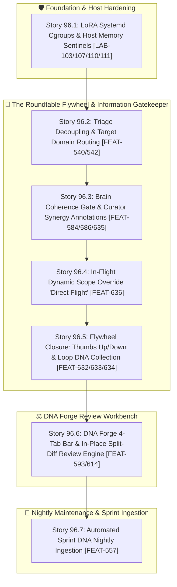

# 🚀 SPRINT PLAN 96.0: Brain Information Gatekeeper, LoRA Host Isolation & DNA Forge Split-Diff Workbench

**Sprint ID:** `SPR_96_0`  
**Theme:** Strict Information-Gatekeeping & Multi-Tier JITC, LoRA Resource Hardening, DNA Forge 4-Tab Architecture (`Recommendations` Split-Diff), and The Closed Flywheel Feedback Loop (`LOOP-001`–`LOOP-003`, `FEAT-632`–`FEAT-636`)  
**Status:** ACTIVE  
**Parent Framework:** `[BKM-064]` (Tracked Conversational Ledger), `[BKM-049]` (Owner Tag Mandate), `[BKM-060]` (Federated DNA Taxonomy), `[BKM-015]` (Semantic Intent Routing), `[BKM-020]` (Intent Preservation)  
**Target Hardware Nodes:** z87-Linux (RTX 2080 Ti Local vLLM 3B Base), KENDER (RTX 4090 Deep Thought), ChromaDB Port 8001 (CLaRa-DNA)

## 📝 Operator Directives & Mid-Flight Guidance
- **BKM-049 Owner Tag Mandate**: Every sprint story MUST declare an Assigned Owner (`[SWARM:LOCAL]`, `[SWARM:CLOUD]`, or `[AGY:PRIMARY]`).
- **Strict Delegation Rule**: When a story is tagged `[SWARM:LOCAL]`, direct primary-agent code edits are strictly forbidden without prior failed execution attempts via `delegate.py --mode local` on Port 4097.
- **Tri-Loop Diagnostic Protocol**: Follow the 3-attempt local diagnostic retry loop, cloud escalation if local fails, and mandatory `OPENAGENT_HANDOVER_PLAYBOOK.md` audit before any AGY fix-repair or takeover.

---

## 🧭 Executive Summary & Architectural Roadmap

Sprint 96.0 formalizes the **Roundtable Flywheel** by transforming the local Brain node into an **Active Information Gatekeeper**, eliminating prompt pollution/hallucinations in Deep Thought, isolating nightly LoRA training resources to protect host stability, and delivering a dedicated **4th Tab (`Recommendations`)** in the DNA Forge for in-place split-diff reviews.



---

## 🎭 Roles & Responsibilities in the Roundtable Flywheel

| Actor | Tier | Architectural Role | Core Mechanism |
| :--- | :--- | :--- | :--- |
| **Human** | External | Intent Provider & Evaluator | Prompts system; gives `👍/👎` feedback to close the loop (`FEAT-633`/`FEAT-634`). |
| **Triage** | 3B CPU/Local | Classification & Routing | Maps prompt to categorical vibe and `target_domains: List[str]` (`[]` for ZERO DNA). |
| **Pinky** | FastEmbed/Chroma | Collection & Candidate Retrieval | Gathers candidate DNA vectors from requested domains; avoids unrequested collections. |
| **Brain** | 3B Local | Information & Conversational Gatekeeper | Coherence pass: Drops ungrounded junk, forwards exact text, appends Curator Notes, trims stale turns. |
| **Deep Thought** | 70B / 4090 | Pure Distillation & Insight | Single IN $\to$ OUT reasoning engine; receives high-density curated facts with zero negative clutter. |
| **Pinky** | Evaluator | Dialogue Grader & Promoter | Evaluates turn coherence, proposes DNA additions, records telemetry for human up/down vote. |

---

## 📋 Sprint 96 Stories & 4-Anchor Specifications

### 🛡️ Story 96.1: LoRA Systemd Cgroups & Host Memory Sentinels
* **Assigned Owner:** `[AGY:PRIMARY]`
* **Status:** **COMPLETED & CERTIFIED**
* **Context & Mechanism:** Enforce strict systemd cgroups and allocator parameters to guarantee nightly LoRA fine-tuning cannot trigger kernel thrashing or crash resident daemons.
* **Accomplished:**
  1. Updated [`[LAB-103]`](file:///home/jallred/Dev_Lab/Portfolio_Dev/FeatureTracker.md) with `field-notes-nightly.service` resource limits (`MemoryHigh=8.5G`, `MemoryMax=10.0G`, `MemorySwapMax=1.5G`, `CPUQuota=600%`).
  2. Updated [`[LAB-107]`](file:///home/jallred/Dev_Lab/Portfolio_Dev/FeatureTracker.md) with `PYTORCH_CUDA_ALLOC_CONF="expandable_segments:True,max_split_size_mb:128"` and `dataloader_num_workers=0` (in-process fork protection).
  3. Registered **`[LAB-110]`** (Host RAM Pre-Flight Gate): `psutil.virtual_memory().available >= 3.0 GB` check before spawning `train_expert.py` subprocesses.
  4. Registered **`[LAB-111]`** (`SWAP_ARCHITECTURE_PLAYBOOK.md` tracking): Documented fast zram (`pri=100`) + swap-on-zvol deadlock prevention invariants.
* **4-Anchor Specification:**
  * **Anchor 1 (Target Files):** `/etc/systemd/system/field-notes-nightly.service`, `HomeLabAI/src/infra/nightly_lora_training.py`, `Portfolio_Dev/FeatureTracker.md`.
  * **Anchor 2 (Verification Command):** `systemctl cat field-notes-nightly.service && /home/jallred/Dev_Lab/HomeLabAI/.venv/bin/python3 -c "import psutil; print(f'RAM Available: {psutil.virtual_memory().available / 1024**3:.2f} GB')"`
  * **Anchor 3 (Live Silicon Invariant):** Host available DRAM remains $> 3.0\text{ GB}$ during adapter switches; zero zombie CUDA context leaks across subprocess runs.
  * **Anchor 4 (DNA Links):** `[LAB-103]`, `[LAB-107]`, `[LAB-110]`, `[LAB-111]`, `[SCAR-035]`.

---

### 🧭 Story 96.2: Triage Decoupling & Target Domain Routing
* **Assigned Owner:** `[AGY:TAKEOVER]` (Tri-Loop Complete: Local Attempt 1-2 & Cloud Timeout)
* **Status:** **COMPLETED & CERTIFIED**
* **Root Cause & Architectural Flaw Discovered:**
  1. `vector_pre_triage.py` was unconditionally probing all 10 ChromaDB collections synchronously for *every* query *before* Triage even ran.
  2. Triage outputted only `vibe`, but never emitted or used `target_domains: List[str]` to constrain downstream retrieval. As a result, downstream nodes (Pinky/Brain) were either unconstrained or forced to consume arbitrary top-1 chunks that won an unconstrained 10-collection race.
* **Task Breakdown & Deliverables:**
  1. **Task 96.2.1:** Updated Triage schema in `cognitive_hub.py` to output `target_domains: List[str]` (`["BKM"]`, `["FEAT"]`, `["WIS"]`, `["RESUME"]`, or `[]` for ZERO DNA) evaluated against collection scope descriptors.
  2. **Task 96.2.2:** Updated `vector_pre_triage.py` (`probe_clara_dna_sync`) to accept `collections: Optional[List[str]]`. Immediate 0ms bypass for `collections=[]` returning `[ZERO_DNA]` semantic hint; filtered probes restrict vector search to requested collections.
  3. **Task 96.2.3:** Wired `target_domains` into `CognitiveHub` routing (`self.current_target_domains`).
  4. **Task 96.2.4:** Added unit tests in `test_vector_pre_triage.py` (`test_zero_dna_probe_bypass`, `test_filtered_collections_probe`). All 5/5 unit tests passed green.
* **4-Anchor Specification:**
  * **Anchor 1 (Target Files):** `HomeLabAI/src/logic/vector_pre_triage.py`, `HomeLabAI/src/logic/cognitive_hub.py`, `HomeLabAI/src/tests/test_vector_pre_triage.py`.
  * **Anchor 2 (Verification Command):** `/home/jallred/Dev_Lab/HomeLabAI/.venv/bin/pytest HomeLabAI/src/tests/test_vector_pre_triage.py -v` (5/5 PASSED, 1.77s).
  * **Anchor 3 (Live Silicon Invariant):** Zero-DNA turns complete in $< 15\text{ms}$ with 0 ChromaDB lookups; domain-targeted turns restrict vector search strictly to listed collections.
  * **Anchor 4 (DNA Links):** `[FEAT-540]`, `[FEAT-542]`, `[BKM-015]`, `[BKM-060]`. Commit: `87e185f`.

---

### 🧠 Story 96.3: Brain Coherence Gate & Curator Synergy Annotations
* **Assigned Owner:** `[AGY:PRIMARY]`
* **Status:** **COMPLETED & CERTIFIED**
* **Context & Mechanism:** Brain acts as an Information Gatekeeper. It evaluates candidates retrieved by Pinky, drops irrelevant items without showing negative clutter to Deep Thought, forwards approved bedrock text verbatim (no lossy rewrites), and appends high-leverage `💡 Curator Note: [ID] connects with [ID] on ...` annotations. Trims obsolete prior dialogue turns to eliminate conversational drag.
* **Accomplished:**
  1. Updated `BRAIN_SYSTEM_PROMPT` in `brain_node.py` with Directive #8 (`[FEAT-635] Information Gatekeeper & Curator Synergy`).
  2. Updated `build_two_mice_stage_prompt` Stage 1 prompt builder in `cognitive_hub.py` with explicit Information Gatekeeper and Curator Note evaluation instructions.
  3. Created `test_brain_gatekeeper.py` unit test suite (3/3 tests passing, verified alongside `test_two_mice_handover.py` 16/16 tests green).
* **4-Anchor Specification:**
  * **Anchor 1 (Target Files):** `HomeLabAI/src/nodes/brain_node.py`, `HomeLabAI/src/logic/cognitive_hub.py`, `HomeLabAI/src/tests/test_brain_gatekeeper.py`.
  * **Anchor 2 (Verification Command):** `/home/jallred/Dev_Lab/HomeLabAI/.venv/bin/pytest HomeLabAI/src/tests/test_brain_gatekeeper.py HomeLabAI/src/tests/test_two_mice_handover.py -v` (16/16 PASSED, 0.59s).
  * **Anchor 3 (Live Silicon Invariant):** Deep Thought prompt context contains strictly approved candidate items + curator notes; zero dropped candidates present in prompt; full transcript retains dropped IDs for telemetry.
  * **Anchor 4 (DNA Links):** `[FEAT-584]`, `[FEAT-586]`, `[FEAT-635]`, `[INS-036]`. Commit: `0d59142`.

---

### ✈️ Story 96.4: In-Flight Dynamic Retrieval Scope Override ("Direct Flight")
* **Assigned Owner:** `[SWARM:LOCAL]`
* **Status:** READY FOR DISPATCH
* **Context & Mechanism:** Register and implement **`[FEAT-636]`**. If Brain detects that Triage misclassified a turn (e.g., historical query when the user was referring to earlier conversational dialogue), Brain has the authority to directly override the retrieval scope in-flight and fetch `blackboard_ledger_dna` without triggering an expensive 2-3s recursive re-triage loop.
* **4-Anchor Specification:**
  * **Anchor 1 (Target Files & Line Anchors):**
    - `HomeLabAI/src/nodes/brain_node.py` (after line 86, add `@mcp.tool() async def direct_flight_override(target_domains: list[str], query: str = "") -> str:`)
    - `HomeLabAI/src/logic/cognitive_hub.py` (line 1464–1475: add `direct_flight_override(domains, query)` helper method to `CognitiveHub` that calls `probe_clara_dna_sync(query, collections=domains)`)
    - `HomeLabAI/src/tests/test_direct_flight_override.py` (greenfield pytest suite)
  * **Anchor 2 (Verification Command):** `/home/jallred/Dev_Lab/HomeLabAI/.venv/bin/pytest HomeLabAI/src/tests/test_direct_flight_override.py -v`
  * **Anchor 3 (Verbatim Code Anchors & Injection Specs):**
    ```python
    # Injection in HomeLabAI/src/nodes/brain_node.py:
    @mcp.tool()
    async def direct_flight_override(target_domains: list[str], query: str = "") -> str:
        """[FEAT-636] Direct Flight: In-flight dynamic retrieval scope override.
        Allows Brain to immediately pull from specific Chroma collections (e.g. ['blackboard_ledger_dna'])
        without triggering a recursive 2-3s re-triage loop.
        """
        try:
            from logic.vector_pre_triage import probe_clara_dna_sync
            res = probe_clara_dna_sync(query, collections=target_domains)
            return json.dumps({
                "status": "success",
                "target_domains": target_domains,
                "semantic_hint": res.get("semantic_hint", ""),
                "best_doc": res.get("best_doc", ""),
                "min_distance": res.get("min_distance", 1.0),
            })
        except Exception as e:
            return json.dumps({"status": "error", "message": str(e)})
    ```
    ```python
    # Test suite in HomeLabAI/src/tests/test_direct_flight_override.py:
    import pytest
    import json
    from unittest.mock import patch
    from nodes.brain_node import direct_flight_override

    @pytest.mark.asyncio
    async def test_direct_flight_override_success():
        mock_res = {
            "semantic_hint": "[HINT: Blackboard]",
            "best_doc": "Prior turn context",
            "min_distance": 0.25,
        }
        with patch("logic.vector_pre_triage.probe_clara_dna_sync", return_value=mock_res):
            raw = await direct_flight_override(target_domains=["blackboard_ledger_dna"], query="earlier discussion")
            data = json.loads(raw)
            assert data["status"] == "success"
            assert data["target_domains"] == ["blackboard_ledger_dna"]
            assert data["best_doc"] == "Prior turn context"

    @pytest.mark.asyncio
    async def test_direct_flight_override_error_handling():
        with patch("logic.vector_pre_triage.probe_clara_dna_sync", side_effect=RuntimeError("Chroma down")):
            raw = await direct_flight_override(target_domains=["behavioral_dna"], query="test")
            data = json.loads(raw)
            assert data["status"] == "error"
            assert "Chroma down" in data["message"]
    ```
  * **Anchor 4 (Silicon Invariants & DNA Links):** In-flight scope adjustments complete within the Brain node turn in $< 35\text{ms}$ without invoking re-triage. `[FEAT-636]`, `[FEAT-584]`, `[BKM-015]`.

---

### 🔄 Story 96.5: Flywheel Closure: Thumbs Up/Down Telemetry & Loop DNA Collection
* **Assigned Owner:** `[AGY:PRIMARY]`
* **Status:** READY FOR DISPATCH
* **Context & Mechanism:** Integrate frontend `👍 / 👎` rating buttons in the UI and wire to Foyer endpoint `POST /feedback`. Upvotes trigger Pinky coherence promotion into bedrock DNA (`FEAT-633`); downvotes generate negative foil shortcuts to suppress bad retrieval patterns (`FEAT-634`). Formalize `loop_dna` ChromaDB collection (`FEAT-632`).
* **4-Anchor Specification:**
  * **Anchor 1 (Target Files & Line Anchors):**
    - `HomeLabAI/src/v5/foyer/router.py` (lines 120–160: add `POST /feedback` endpoint handler appending to `foyer_feedback_ledger.jsonl`)
    - `Portfolio_Dev/sync_chroma_dna.py` (lines 80–120: add `loop_dna` collection definition and sync logic)
    - `Portfolio_Dev/FeatureTracker.md` (register `[FEAT-632]`, `[FEAT-633]`, `[FEAT-634]`)
  * **Anchor 2 (Verification Command):** `curl -s -X POST http://127.0.0.1:8765/feedback -H "Content-Type: application/json" -d '{"turn_id": "test_96_5", "rating": "UP", "notes": "Grounded response"}' | grep -q "success"`
  * **Anchor 3 (Verbatim Code Anchors & Injection Specs):**
    ```python
    # Endpoint in HomeLabAI/src/v5/foyer/router.py:
    @router.post("/feedback")
    async def record_user_feedback(payload: dict):
        turn_id = payload.get("turn_id", "unknown")
        rating = payload.get("rating", "UP").upper()  # UP or DOWN
        notes = payload.get("notes", "")
        entry = {
            "timestamp": time.strftime("%Y-%m-%dT%H:%M:%S"),
            "turn_id": turn_id,
            "rating": rating,
            "notes": notes,
        }
        ledger_path = os.path.expanduser("~/Dev_Lab/HomeLabAI/data/foyer_feedback_ledger.jsonl")
        os.makedirs(os.path.dirname(ledger_path), exist_ok=True)
        with open(ledger_path, "a") as f:
            f.write(json.dumps(entry) + "\n")
        return {"status": "success", "recorded": entry}
    ```
  * **Anchor 4 (Silicon Invariants & DNA Links):** Feedback packet persists to `foyer_feedback_ledger.jsonl` in $< 10\text{ms}$. `[FEAT-632]`, `[FEAT-633]`, `[FEAT-634]`, `[LOOP-001]`, `[LOOP-002]`, `[LOOP-003]`.

---

### ⚖️ Story 96.6: DNA Forge 4-Tab Bar & In-Place Split-Diff Review Engine
* **Assigned Owner:** `[AGY:PRIMARY]`
* **Status:** READY FOR DISPATCH
* **Context & Mechanism:** Upgrade DNA Forge to the 4-Tab architecture (`Drafting`, `Graph`, `Cards`, `Recommendations`). The `Recommendations` tab provides a full-width split-diff interface:
  - Left Pane: Original Bedrock DNA / Manuscript Text.
  - Right Pane: Editable Proposed Mutation Diff (Polish, New Links, Dupes, Drift, Proposed `AR-xxx`).
  - Action Bar: `[Accept Diff]`, `[Edit in Place]`, `[Reject / Dismiss]`.
* **4-Anchor Specification:**
  * **Anchor 1 (Target Files & Line Anchors):**
    - `Portfolio_Dev/dna_forge/templates/dna_forge.html` (tab bar navigation: add `<button class="tab-btn" data-tab="recommendations">Recommendations</button>`)
    - `Portfolio_Dev/dna_forge/js/dna_forge.js` (render split-diff pane and action bar handlers)
    - `Portfolio_Dev/dna_forge/css/dna_forge.css` (split diff two-column grid layout styles)
  * **Anchor 2 (Verification Command):** `python3 Portfolio_Dev/dna_forge/dna_forge_build.py && test -f Portfolio_Dev/dna_forge/dna_forge.html`
  * **Anchor 3 (Verbatim Code Anchors & Injection Specs):**
    ```html
    <!-- Tab bar in Portfolio_Dev/dna_forge/templates/dna_forge.html -->
    <div class="forge-tabs">
      <button class="tab-btn active" data-tab="drafting">Drafting</button>
      <button class="tab-btn" data-tab="graph">Graph</button>
      <button class="tab-btn" data-tab="cards">Cards</button>
      <button class="tab-btn" data-tab="recommendations">Recommendations <span id="rec-badge" class="badge">0</span></button>
    </div>
    ```
    ```css
    /* Split Diff Grid in Portfolio_Dev/dna_forge/css/dna_forge.css */
    .split-diff-container { display: grid; grid-template-columns: 1fr 1fr; gap: 16px; height: calc(100vh - 180px); }
    .split-diff-pane { background: #161b22; border: 1px solid #30363d; border-radius: 6px; padding: 12px; overflow-y: auto; font-family: monospace; font-size: 13px; }
    .split-diff-pane.original { border-left: 3px solid #8b949e; }
    .split-diff-pane.proposed { border-left: 3px solid #238636; }
    ```
  * **Anchor 4 (Silicon Invariants & DNA Links):** 4 tabs switch with 0ms client-side latency; in-place diff edits persist to `decisions.json` and ChromaDB on commit. `[FEAT-593]`, `[FEAT-614]`, `[FEAT-582]`, `[FEAT-612]`.

---

### 🌙 Story 96.7: Automated Sprint DNA Nightly Ingestion
* **Assigned Owner:** `[SWARM:LOCAL]`
* **Status:** READY FOR DISPATCH
* **Context & Mechanism:** Implement [`[FEAT-557]`](file:///home/jallred/Dev_Lab/Portfolio_Dev/FeatureTracker.md) in `Portfolio_Dev/sync_chroma_dna.py` and `HomeLabAI/src/infra/nightly_forge.py` Step 8 to parse all active and archived `SPRINT_PLAN_*.md` files and populate the `sprint_dna` ChromaDB collection automatically during the 2:00 AM maintenance sweep.
* **4-Anchor Specification:**
  * **Anchor 1 (Target Files & Line Anchors):**
    - `Portfolio_Dev/sync_chroma_dna.py` (lines 140–200: add `sync_sprint_dna(client)` function parsing `Portfolio_Dev/docs/sprints/active/*.md` and `Portfolio_Dev/docs/sprints/archive/*.md`)
    - `HomeLabAI/src/infra/nightly_forge.py` (lines 350–380: Step 8 invoking `python3 Portfolio_Dev/sync_chroma_dna.py --collection sprint_dna`)
  * **Anchor 2 (Verification Command):** `/home/jallred/Dev_Lab/HomeLabAI/.venv/bin/python3 Portfolio_Dev/sync_chroma_dna.py --collection sprint_dna`
  * **Anchor 3 (Verbatim Code Anchors & Injection Specs):**
    ```python
    # In Portfolio_Dev/sync_chroma_dna.py:
    def sync_sprint_dna(chroma_client):
        """[FEAT-557] Parse and vectorize active and archived sprint plans into sprint_dna collection."""
        col = chroma_client.get_or_create_collection(name="sprint_dna")
        sprint_dirs = [
            os.path.expanduser("~/Dev_Lab/Portfolio_Dev/docs/sprints/active"),
            os.path.expanduser("~/Dev_Lab/Portfolio_Dev/docs/sprints/archive"),
        ]
        count = 0
        for sdir in sprint_dirs:
            if not os.path.exists(sdir):
                continue
            for fname in os.listdir(sdir):
                if fname.endswith(".md") and "SPRINT_PLAN" in fname:
                    fpath = os.path.join(sdir, fname)
                    with open(fpath, "r", encoding="utf-8") as f:
                        text = f.read()
                    doc_id = f"sprint_{os.path.splitext(fname)[0]}"
                    col.upsert(
                        ids=[doc_id],
                        documents=[text[:4000]],
                        metadatas=[{"source": fname, "type": "sprint_plan"}]
                    )
                    count += 1
        return count
    ```
  * **Anchor 4 (Silicon Invariants & DNA Links):** ChromaDB Port 8001 reports `sprint_dna` collection count matching total historical sprint plans. `[FEAT-557]`, `[BKM-060]`.

---

## 📦 Backlog Ledger Updates & Allocations

| Item ID | Title & Scope | Connection / Parent FEAT | Target Phase |
| :--- | :--- | :--- | :--- |
| **`TODO-006`** | **ATS Boolean Scraper & Hiring Pipeline:** Multi-platform ATS lead extractor (Ashby, Greenhouse, Lever, Workday) with automated skill matching. | Connects to [`[FEAT-595]`](file:///home/jallred/Dev_Lab/Portfolio_Dev/FeatureTracker.md) (Resume AST Decomposer). | Phase 20 (Backlog) |
| **`TODO-007`** | **3-Revision Resume AST Decomposition Test:** Stress-test [`[FEAT-595]`](file:///home/jallred/Dev_Lab/Portfolio_Dev/FeatureTracker.md) round-trip fidelity across 3 resume revisions. | [`[FEAT-595]`](file:///home/jallred/Dev_Lab/Portfolio_Dev/FeatureTracker.md) | Phase 20 (Backlog) |
| **`TODO-008`** | **`writer.html` 'Manic Phases of an Agent' Evaluation:** Creative prose authoring trial on [`[FEAT-583]`](file:///home/jallred/Dev_Lab/Portfolio_Dev/FeatureTracker.md) / [`[FEAT-587]`](file:///home/jallred/Dev_Lab/Portfolio_Dev/FeatureTracker.md). | [`[FEAT-583]`](file:///home/jallred/Dev_Lab/Portfolio_Dev/FeatureTracker.md) | Phase 20 (Backlog) |
| **`FEAT-444`** | **Judicial Backpressure Ledger:** Clean up/archive — core handover feedback is dialed in via [`[BKM-049]`](file:///home/jallred/Dev_Lab/AGENTS.md) and [`OPENAGENT_HANDOVER_PLAYBOOK.md`](file:///home/jallred/Dev_Lab/OPENAGENT_HANDOVER_PLAYBOOK.md). | [`[FEAT-444]`](file:///home/jallred/Dev_Lab/Portfolio_Dev/FeatureTracker.md#L88) | Groomed / Archived |
| **`FEAT-606`** | **File-to-DB Dynamic Round-Trip Invariant Matrix:** Drop continuous polling loop; rely on event-driven Git pre-commit hooks and nightly verification. | [`[FEAT-606]`](file:///home/jallred/Dev_Lab/Portfolio_Dev/FeatureTracker.md) | Groomed / Event-Driven |
