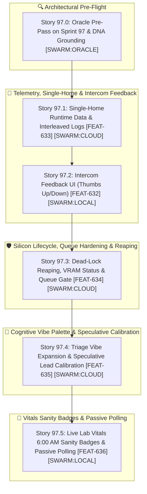

# 🚀 SPRINT PLAN 97.0: Single-Home Runtime Data, Intercom Feedback Loop & Cognitive Triage Vibe Expansion

**Sprint ID:** `SPR_97_0`  
**Theme:** Single Canonical File Homes (Anti-Duplication), Active Feedback Loop Closure (`👍/👎`), Process Lifecycle & Dead-Lock Reaping, Expanded Cognitive Vibe Palette (`SOCRATIC`, `CHRONICLE`, `RETROSPECTIVE`, etc.), and Passive Telemetry Gating (`FEAT-632`–`FEAT-636`)  
**Status:** ACTIVE  
**Parent Framework:** `[BKM-049]` (The Delegation Execution Rulebook), `[BKM-071]` (Delegation Playbook Index), `[BKM-060]` (Federated DNA Domains), `[BKM-015]` (Semantic Anchor Protocol), `[BKM-020]` (High-Fidelity Sprint Documentation), `[INS-038]` (The Rug Bump Law), `[INS-042]` (The Waffle Trap & Circular Fixing Traps)  
**Target Silicon Nodes:** z87-Linux (RTX 2080 Ti Local vLLM 3B Base), Node KENDER (RTX 4090 Ollama Conductor), Node Brain (macOS M5 Air MLX :8002), ChromaDB Port 8001 (CLaRa-DNA)

## 📝 Operator Directives & Governance Rules
- **BKM-049 Story Owner Tag Law**: Every sprint story MUST declare an Assigned Owner (`[SWARM:LOCAL]`, `[SWARM:CLOUD]`, `[SWARM:ORACLE]`, or `[AGY:PRIMARY]`).
- **Strict Anti-Bypass Guard**: Direct primary-agent code edits on `[SWARM:*]` stories are strictly forbidden without prior failed execution attempts via `delegate.py`.
- **Tri-Loop Diagnostic Protocol**: Follow the 3-attempt local diagnostic retry loop for `[SWARM:LOCAL]`, direct cloud dispatch for `[SWARM:CLOUD]`, and mandatory `OPENAGENT_HANDOVER_PLAYBOOK.md` audit before any AGY takeover.
- **Single Canonical Homes (Rule 4)**: Multi-homing and copying runtime files between submodules is prohibited. Write dynamic logs and ledgers directly to `Portfolio_Dev/field_notes/data/`.

---

## 🧭 Executive Summary & Architectural Roadmap

Sprint 97.0 executes critical operational hardening and cognitive expansion across the Federated Lab:
1. **Story 97.0 (Oracle Pre-Pass):** Pre-certifies sprint contracts and test matrices against bedrock DNA invariants.
2. **Story 97.1 (Single-Home Runtime Data):** Abolishes multi-homed file writing; routes accountability ledgers directly to canonical data directories and integrates them into the `status.html` Interleaved System Log timeline.
3. **Story 97.2 (Intercom Feedback UI):** Implements clickable `👍/👎` feedback icons in `intercom.html` / `intercom_v2.js` connecting directly to the `POST /feedback` REST bridge (`[FEAT-632]`).
4. **Story 97.3 (Dead-Lock Reaping & Queue Hardening):** Deploys automated 05:45 AM stale lock reaping in the Attendant with `CRITICAL` alerting, eliminates bogus "Lab Hibernating" messages in `types.py`, and enforces "Disabled to Send" button gating.
5. **Story 97.4 (Triage Vibe Expansion):** Deprecates `CASUAL` vibe; implements an expressive cognitive palette (`SOCRATIC`, `FORENSIC`, `CHRONICLE`, `RETROSPECTIVE`, `ARCHITECTURAL`, `TACTICAL`, `STRATEGIC`, `PROVOCATIVE`, `METABOLIC`) with BKM-015 vector hints and M5 Air speculative lead calibration.
6. **Story 97.5 (Live Lab Vitals & Passive Guarantee):** Adds "6:00 AM Daily Sanity Check" visual badges to `status.html` vital cards and quarantines audio vocal synthesis testing strictly to the 06:00 AM daily health audit.
7. **Infrastructure Hardening (`[FEAT-642]` / `[FEAT-643]`):** Deploys `clara-dna_read` (First-Touch AST Blueprint + Bounded Slicing) and asynchronous semantic pre-warming via M5 Air (`#jitc`, `[LAB-019]`), eliminating multi-turn conductor slicing loops and preserving <2,000 token context on KENDER 4090.

---

## 📋 Sprint 97 Stories & 4-Anchor Specifications

### 🔍 Story 97.0: Oracle Pre-Pass on Sprint 97 Plan & Architectural Invariant Grounding
* **Assigned Owner:** `[SWARM:ORACLE]`
* **Status:** **COMPLETED & CERTIFIED**
* **Why & Root Cause:** Prevent circular fixing traps (`INS-042`) and enforce complexity conservation (`INS-038`) before code dispatch.
* **Mechanism:** The Oracle persona audited Sprint 97 story specifications against bedrock protocols (`BKM-006`, `BKM-024`, `BKM-049`, `BKM-060`, `BKM-071`, `BKM-073`). Validated that all target files exist, test batteries are declared verbatim, and owner tags comply with swarm governance. Output compiled to [`Portfolio_Dev/docs/sprints/active/ORACLE_REVIEW_SPRINT_97.md`](file:///home/jallred/Dev_Lab/Portfolio_Dev/docs/sprints/active/ORACLE_REVIEW_SPRINT_97.md).
* **4-Anchor Specification:**
  * **Anchor 1 (Target Files):** `Portfolio_Dev/docs/sprints/active/SPRINT_PLAN_SPR_97_0.md`, `Portfolio_Dev/docs/sprints/active/ORACLE_REVIEW_SPRINT_97.md`.
  * **Anchor 2 (Verification Command):** `delegate.py --persona oracle --task "Audit Sprint 97 story contracts"` (Certified in `ORACLE_REVIEW_SPRINT_97.md`).
  * **Anchor 3 (Live Silicon Invariant):** 100% of sprint stories verified for single canonical file paths, explicit test commands, and non-overlapping vibe scopes.
  * **Anchor 4 (DNA Links):** `[BKM-049]`, `[BKM-071]`, `[INS-038]`, `[INS-042]`.

---

#### 📡 Story 97.1: Single-Home Runtime Data & Accountability in Interleaved Logs
* **Assigned Owner:** `[SWARM:CLOUD]`
* **Feature Anchor:** `[FEAT-637]`
* **Status:** **COMPLETED & CERTIFIED**
* **Why & Root Cause:** Multi-homed writes between `Portfolio_Dev/field_notes/data/` and `www_deploy/data/` caused split-brain status discrepancies. Morning accountability audits were writing to isolated run paths, leaving `pollPager()` blind in `status.html`.
* **Task Breakdown:**
  1. Updated `standalone_accountability_watchdog.py`: removed `WWW_DEPLOY_DIR` dual-write loop; writes exclusively to `OUTPUT_DIR` (`Portfolio_Dev/field_notes/data/`). Added `append_accountability_ledger()` logging exact 5-field schema.
  2. Updated `pollPager()` in `Portfolio_Dev/field_notes/status.html` to fetch `data/accountability_ledger.jsonl` and inject green accountability badge events interleaved into the unified forensic timeline.
  3. Added test battery `HomeLabAI/src/tests/test_accountability_ledger.py` (4/4 passed).
* **4-Anchor Specification:**
  * **Anchor 1 (Target Files):** `Portfolio_Dev/field_notes/status.html`, `HomeLabAI/src/infra/standalone_accountability_watchdog.py`, `HomeLabAI/src/tests/test_accountability_ledger.py`.
  * **Anchor 2 (Verification Command):** `/home/jallred/Dev_Lab/HomeLabAI/.venv/bin/pytest HomeLabAI/src/tests/test_accountability_ledger.py -v` (4/4 PASSED).
  * **Anchor 3 (Live Silicon Invariant):** Zero duplicate runtime data writes to `www_deploy/data/`; `accountability_ledger.jsonl` rendered in `status.html` timeline.
  * **Anchor 4 (DNA Links):** `[FEAT-637]`, `[BKM-022]`, `[BKM-024]`.

---

### 👍 Story 97.2: Intercom Feedback UI (Thumbs Up/Down) & Co-Pilot Bridge
* **Assigned Owner:** `[SWARM:LOCAL]`
* **Feature Anchor:** `[FEAT-638]`
* **Status:** **COMPLETED & CERTIFIED**
* **Why & Root Cause:** Story 96.5 implemented the backend `POST /feedback` endpoint in `router.py`, but the user-facing clickable icons were deferred, leaving the Fourth Wall feedback flywheel open.
* **Task Breakdown:**
  1. Add discrete `👍` (thumbs up) and `👎` (thumbs down) icon buttons to assistant message bubbles in `Portfolio_Dev/field_notes/intercom.html` and `intercom_v2.js`.
  2. Wire click handlers to send `POST /feedback` payloads (`{ "message_id": id, "verdict": "UP"|"DOWN", "query": q, "response": r }`) to Foyer port `8765`.
  3. Provide instant visual feedback (green/red active glow) and toast notification upon successful recording.
* **4-Anchor Specification:**
  * **Anchor 1 (Target Files):** `Portfolio_Dev/field_notes/intercom.html`, `Portfolio_Dev/field_notes/intercom_v2.js`.
  * **Anchor 2 (Verification Command):** `/home/jallred/Dev_Lab/HomeLabAI/.venv/bin/pytest HomeLabAI/src/tests/test_foyer_feedback.py -v`
  * **Anchor 3 (Live Silicon Invariant):** User feedback clicks immediately append JSONL records to `foyer_feedback_ledger.jsonl` on port 8765.
  * **Anchor 4 (DNA Links):** `[FEAT-638]`, `[BKM-035]`, `[INS-033]`.

---

### 🛡️ Story 97.3: Dead-Lock Reaping, VRAM Status Clean-up & Queue Hardening
* **Assigned Owner:** `[SWARM:CLOUD]`
* **Feature Anchor:** `[FEAT-639]`
* **Status:** **PENDING EXECUTION**
* **Why & Root Cause:** 
  1. An unhandled `SIGKILL` during nightly LoRA training left an orphaned `maintenance.lock`, blocking `/wake` and stranding VRAM at 208MB.
  2. `types.py` line 114 contained a hardcoded binary ternary emitting `"Lab Hibernating"` for any non-operational state even when hibernation was disabled.
  3. When Foyer was locked or offline, the intercom UI allowed clicking "Send", dropping user messages.
* **Task Breakdown:**
  1. Deploy an automated **Dead-Lock Reaping Sweep at 05:45 AM** in `HomeLabAI/src/v5/foyer/router.py` / `engine_watchdog.py` checking PID liveness; if `maintenance.lock` exists without an active training process, forcibly delete the lock, log a `CRITICAL` alert to `pager_activity.json`, and trigger `/wake`.
  2. Add a **60-minute hard watchdog** to nightly fine-tuning subprocesses to abort hung jobs before the 06:00 AM audit.
  3. Fix `HomeLabAI/src/v5/common/types.py` line 114 to output genuine state strings (`"Lab Offline"`, `"Standby (Scale-to-Zero)"`, `"Maintenance"`).
  4. Enforce **"Disabled to Send"** button state in `intercom_v2.js` when Foyer is locked/offline, preserving unsent text in the client input area.
* **4-Anchor Specification:**
  * **Anchor 1 (Target Files):** `HomeLabAI/src/v5/foyer/router.py`, `HomeLabAI/src/v5/common/types.py`, `HomeLabAI/src/v5/ignition/manager.py`, `Portfolio_Dev/field_notes/intercom_v2.js`.
  * **Anchor 2 (Verification Command):** `/home/jallred/Dev_Lab/HomeLabAI/.venv/bin/pytest HomeLabAI/src/tests/test_lock_reaper.py -v`
  * **Anchor 3 (Live Silicon Invariant):** Zero orphaned lock files survive beyond 05:45 AM; `status.json` reflects true hardware states with zero false "Hibernating" text.
  * **Anchor 4 (DNA Links):** `[FEAT-639]`, `[FEAT-136]`, `[BKM-044]`, `[BKM-024]`.

---

### 🧠 Story 97.4: Triage Vibe Palette Expansion & Speculative Head-Start Calibration
* **Assigned Owner:** `[SWARM:CLOUD]`
* **Feature Anchor:** `[FEAT-640]`
* **Status:** **PENDING EXECUTION**
* **Why & Root Cause:** `CASUAL` vibe acted as an over-aggressive catch-all that dampened reasoning depth. Work Past vs Recent Past was conflated under "HISTORICAL".
* **Task Breakdown:**
  1. Deprecate `CASUAL` vibe and expand cognitive triage taxonomy in `cognitive_hub.py` and `speculative_triage.py`:
     - `SOCRATIC`: Conceptual inquiries, design trade-offs, philosophical exploration.
     - `FORENSIC`: Tracebacks, crash logs, stack inspection, dead PIDs.
     - `CHRONICLE`: Intel work notes, distilled gems, past engineering milestones, distant past lookups.
     - `RETROSPECTIVE`: Recent lab sprints, yesterday's debugging logs, active session progress.
     - `ARCHITECTURAL`: System boundaries, component interfaces, complexity conservation (`INS-038`).
     - `TACTICAL`: Concrete code edits, surgical fixes, unit testing, task execution.
     - `STRATEGIC`: Portfolio vision, executive synthesis, leadership war stories.
     - `PROVOCATIVE`: Red-teaming, stress-testing design assertions, disagreement trapping.
     - `METABOLIC`: Document spine curation, memory pruning, refining DNA cards.
  2. Update `vector_pre_triage.py` to inject gentle `semantic_hint` vector priors without brittle hardcoded keyword lists (`BKM-015`).
  3. Calibrate `SpeculativeTriageRelay` in `speculative_triage.py` so REST-probed M5 Air is given the full dynamic EWMA lead window ($W_{\text{lead}} = 2 \cdot t_{\text{warmed}} + L_t + 4 \cdot J_t$) before local vLLM is dispatched as a fallback racer.
* **4-Anchor Specification:**
  * **Anchor 1 (Target Files):** `HomeLabAI/src/logic/cognitive_hub.py`, `HomeLabAI/src/logic/speculative_triage.py`, `HomeLabAI/src/logic/vector_pre_triage.py`, `HomeLabAI/src/tests/test_live_pre_reflection_triage.py`.
  * **Anchor 2 (Verification Command):** `/home/jallred/Dev_Lab/HomeLabAI/.venv/bin/pytest HomeLabAI/src/tests/test_live_pre_reflection_triage.py HomeLabAI/src/tests/test_vector_pre_triage.py -v`
  * **Anchor 3 (Live Silicon Invariant):** 100% of test battery queries resolve to correct expanded vibes; M5 Air lead window operates without latency races on warm silicon.
  * **Anchor 4 (DNA Links):** `[FEAT-640]`, `[FEAT-586]`, `[FEAT-583]`, `[BKM-015]`, `[BKM-060]`.

---

### 🏥 Story 97.5: Live Lab Vitals 6:00 AM Daily Sanity Check Badges & Passive Polling Guarantee
* **Assigned Owner:** `[SWARM:LOCAL]`
* **Feature Anchor:** `[FEAT-641]`
* **Status:** **PENDING EXECUTION**
* **Why & Root Cause:** UI vital cards lacked visual anchoring to the 06:00 AM health audit, and live telemetry required verification to ensure 100% passive, zero-wake behavior.
* **Task Breakdown:**
  1. Verify and enforce that all telemetry endpoints (`/status`, `/sys_metrics`, `/telemetry_kpi`, DCGM port 9400) in `HomeLabAI/src/infra/live_telemetry.py` are 100% passive read-only operations with zero `/wake` or GPU ignition side effects.
  2. Quarantine audio vocal synthesis and TTS testing strictly to the 06:00 AM Daily Health Audit (`daily_accountability_audit.py`), barring regular status polling from firing audio pipelines.
  3. Add a visual **"6:00 AM Daily Sanity Check" badge** (`[HEALTH: NOMINAL]` / `[HEALTH: AUDIT_STALE]`) to each vital card in `Portfolio_Dev/field_notes/status.html`.
* **4-Anchor Specification:**
  * **Anchor 1 (Target Files):** `Portfolio_Dev/field_notes/status.html`, `HomeLabAI/src/infra/live_telemetry.py`, `HomeLabAI/src/infra/daily_accountability_audit.py`.
  * **Anchor 2 (Verification Command):** `/home/jallred/Dev_Lab/HomeLabAI/.venv/bin/pytest HomeLabAI/src/tests/test_telemetry_collector.py -v`
  * **Anchor 3 (Live Silicon Invariant):** Continuous 5s status polling produces zero VRAM delta or engine state transitions; vital cards display 06:00 AM health status.
  * **Anchor 4 (DNA Links):** `[FEAT-641]`, `[FEAT-607]`, `[BKM-024]`.

---

## 🔮 Sprint 98+ Architectural Backlog Candidates

### 📌 [BACKLOG-98.1] JITC Bounded Reader Renaming (`clara-dna_read` $\to$ `jitc_read`)
* **Feature Anchor:** `[FEAT-642]`
* **Goal:** Disambiguate codebase reading from vector DNA retrieval by renaming MCP tool `clara-dna_read` to `jitc_read` (or `bounded_read`).

### 📌 [BACKLOG-98.2] L3 Offload: Dedicated Test Runner & Failure Diagnostician on M5 Air
* **Feature Anchor:** `[FEAT-644]` (Candidate)
* **Goal:** Offload test execution and traceback analysis to Sisyphus-Junior on M5 Air. Atlas applies code on 4090 $\to$ L3 runs `pytest`, parses failures, and returns concise 3-line diagnostic fixes to Atlas.

### 📌 [BACKLOG-98.3] Pipelined Speculative Pre-Warming for Story $N+1$
* **Feature Anchor:** `[FEAT-645]` (Candidate)
* **Goal:** While Story $N$ is executing on 4090, `delegate.py` speculatively pre-warms target files for Story $N+1$ concurrently on M5 Air, eliminating start-up pre-warm delay.

### 📌 [BACKLOG-98.4] Background Blast-Radius & Syntax Linter
* **Feature Anchor:** `[FEAT-646]` (Candidate)
* **Goal:** L3 worker runs continuous passive validation (`py_compile`, `node --check`, unassigned file diff audits) during execution.
