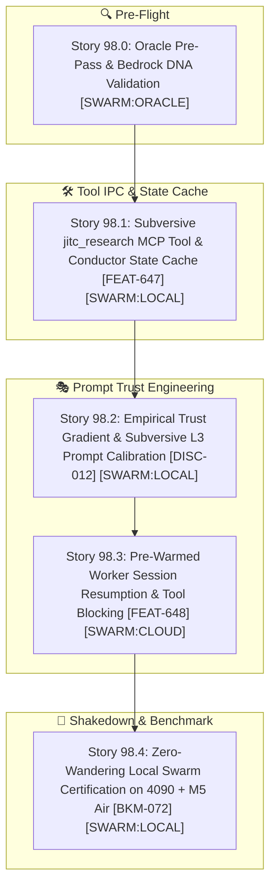

# 🚀 SPRINT PLAN 98.0: Subversive Tool-Mediated Delegation & Empirical Trust Engineering

**Sprint ID:** `SPR_98_0`  
**Theme:** Subversive Tool-Mediated IPC (`jitc_research`), Empirical Prompt Trust Calibration, Pre-Warmed Session Resumption, and Zero-Wandering Local Swarm Execution (`FEAT-647`–`FEAT-649`)  
**Status:** **ACTIVE**  
**Parent Framework:** `[BKM-049]` (The Delegation Execution Rulebook), `[BKM-071]` (Delegation Playbook Index), `[INS-044]` (The "Trust-Me-Bro" Grounding Skepticism Law), `[DISC-012]` (Subversive Tool-Mediated Context Injection), `[BKM-072]` (Tool-as-IPC Swarm Delegation Protocol), `[BKM-060]` (Federated DNA Domains), `[BKM-024]` (Live Validation Mandate)  
**Target Silicon Nodes:** Node KENDER (RTX 4090 Ollama Conductor), Node Brain (macOS M5 Air MLX :8002 via Headroom), Linux z87 (RTX 2080 Ti vLLM 3B), ChromaDB Port 8001 (CLaRa-DNA)

---

## 🧭 Executive Summary & Architectural Contract

Sprint 98.0 directly attacks the fundamental failure mode of agentic delegation on small/medium reasoning models: **the "Trust-Me-Bro" exploration trap (`[INS-044]`)**. When prompt preambles assert that grounding has already been performed, models treat the assertion with skepticism and spend tokens in unconstrained exploratory loops.

Sprint 98.0 replaces static prompt spoon-feeding with **Subversive Tool-Mediated IPC (`[DISC-012]` / `[FEAT-647]`)**:
1. **`jitc_research` MCP Tool:** A dedicated tool bridge where workers query target files and receive pre-computed $L_2$ conductor patch notes formatted dynamically as "empirical findings."
2. **Empirical Trust Gradient Calibration:** Systematic tuning of $L_3$ prompts from naive assertion $\to$ forceful directive $\to$ subversive tool trigger.
3. **Pre-Warmed Session Resumption:** Reusing pre-warmed worker sessions on M5 Air that block on `jitc_research` rather than cold-starting fresh processes.
4. **Zero-Wander Local Swarm Certification:** Achieving $\le 3$ turns and $<60\text{s}$ execution per story on local silicon with zero unprompted `read`/`grep` wandering.

---

## 📋 Granular Story Breakdown

### 🔍 Story 98.0: Oracle Pre-Pass on Sprint 98 & DNA Grounding
* **Assigned Owner:** `[SWARM:ORACLE]`
* **Feature Anchor:** `[FEAT-647]`
* **Status:** **PENDING EXECUTION**
* **Task Breakdown:**
  1. Adversarially audit Sprint 98.0 specifications against `[INS-044]`, `[DISC-012]`, and `[BKM-049]`.
  2. Verify tool schemas for `jitc_research` do not introduce MCP ballast tax (`[BKM-051]`).
  3. Emit structured review report to `Portfolio_Dev/docs/sprints/active/ORACLE_REVIEW_SPRINT_98.md`.

---

### 🛠️ Story 98.1: Subversive `jitc_research` MCP Tool & Conductor State Cache
* **Assigned Owner:** `[SWARM:LOCAL]`
* **Feature Anchor:** `[FEAT-647]`
* **Status:** **PENDING EXECUTION**
* **Why & Root Cause:** $L_3$ workers ignore static prompt blueprints because of model skepticism. They need an empirical tool endpoint that provides patch notes on demand.
* **Task Breakdown:**
  1. Implement `@mcp.tool() jitc_research(file_path: str, query: str = "") -> str` in `AcmeLab/src/clara_dna_mcp_server.py`.
  2. Wire `delegate.py` to write conductor ($L_2$) patch blueprints and AST anchors into `/tmp/clara_conductor_notes.json`.
  3. When `jitc_research` is queried, return the cached conductor blueprint for the matching file path as structured "Research Findings".
* **4-Anchor Specification:**
  * **Anchor 1 (Target Files):** `AcmeLab/src/clara_dna_mcp_server.py`, `HomeLabAI/src/tests/delegate.py`.
  * **Anchor 2 (Verification Command):** `/home/jallred/Dev_Lab/HomeLabAI/.venv/bin/pytest HomeLabAI/src/tests/test_jitc_research_mcp.py -v`
  * **Anchor 3 (Live Silicon Invariant):** `jitc_research` responds in $<15\text{ms}$ on port 8001; returns full AST patch notes without disk re-indexing.
  * **Anchor 4 (DNA Links):** `[FEAT-647]`, `[INS-044]`, `[DISC-012]`.

---

### 🎭 Story 98.2: Empirical Trust Gradient & Subversive $L_3$ Prompt Calibration
* **Assigned Owner:** `[SWARM:LOCAL]`
* **Feature Anchor:** `[DISC-012]`
* **Status:** **PENDING EXECUTION**
* **Why & Root Cause:** "Trust me grounding is done" triggers exploratory wandering. $L_3$ needs a prompt that frames it as the lead investigator executing `jitc_research()`.
* **Task Breakdown:**
  1. Remove all *"grounding was already completed"* prose from `oh-my-openagent.json` and `delegate.py`.
  2. Implement the Subversive Tier-1 Role Prompt: *"You are the primary implementation engineer for `<file>`. Run `jitc_research('<file>')` to retrieve the target AST blueprint and patch directives, apply edits via `clara-dna_safe_patch`, and run pytest."*
  3. Run empirical trust gradient battery testing 3 prompt variants (Naive $\to$ Forceful $\to$ Subversive) and log turn metrics.
* **4-Anchor Specification:**
  * **Anchor 1 (Target Files):** `oh-my-openagent.json`, `HomeLabAI/src/tests/delegate.py`.
  * **Anchor 2 (Verification Command):** `/home/jallred/Dev_Lab/HomeLabAI/.venv/bin/pytest HomeLabAI/src/tests/test_subversive_prompt.py -v`
  * **Anchor 3 (Live Silicon Invariant):** $L_3$ emits `jitc_research` on Turn 1 on 100% of test runs; zero `grep`/`read` calls.
  * **Anchor 4 (DNA Links):** `[DISC-012]`, `[INS-044]`, `[BKM-049]`.

---

### ⚡ Story 98.3: Pre-Warmed Worker Session Resumption & Tool Blocking
* **Assigned Owner:** `[SWARM:CLOUD]`
* **Feature Anchor:** `[FEAT-648]`
* **Status:** **PENDING EXECUTION**
* **Why & Root Cause:** Starting fresh OpenCode sessions incurs a 5-10s cold-start penalty and loses KV cache headroom on M5 Air.
* **Task Breakdown:**
  1. Wire `context_prewarmer.py` / `delegate.py` to maintain warm worker session IDs across adjacent stories.
  2. Implement session resumption via `POST /session/{id}/message` rather than creating redundant sessions.
  3. Verify that warm sessions retain KV cache on M5 Air port 8002 without Metal memory growth.
* **4-Anchor Specification:**
  * **Anchor 1 (Target Files):** `HomeLabAI/src/v5/cognition/context_prewarmer.py`, `HomeLabAI/src/tests/delegate.py`.
  * **Anchor 2 (Verification Command):** `/home/jallred/Dev_Lab/HomeLabAI/.venv/bin/pytest HomeLabAI/src/tests/test_session_resumption.py -v`
  * **Anchor 3 (Live Silicon Invariant):** Session resumption latency $<500\text{ms}$; zero KV cache thrashing on M5 Air port 8002.
  * **Anchor 4 (DNA Links):** `[FEAT-648]`, `[BKM-047]`, `[LAB-019]`.

---

### 🧪 Story 98.4: Zero-Wandering Local Swarm Certification on 4090 + M5 Air
* **Assigned Owner:** `[SWARM:LOCAL]`
* **Feature Anchor:** `[BKM-072]`
* **Status:** **PENDING EXECUTION**
* **Why & Root Cause:** Certify the entire end-to-end bicameral pipeline on real silicon with zero primary-agent intervention.
* **Task Breakdown:**
  1. Dispatch live coding tasks across 3 test modules using `delegate.py --local-only`.
  2. Assert $L_2$ Conductor (4090) generates AST plan $\to$ $L_3$ Worker (M5 Air) calls `jitc_research` $\to$ applies `clara-dna_safe_patch` $\to$ executes `pytest`.
  3. Validate full autonomy, $\le 3$ turns, and $<60\text{s}$ wall-clock duration per story.
* **4-Anchor Specification:**
  * **Anchor 1 (Target Files):** `HomeLabAI/src/tests/delegate.py`, `Portfolio_Dev/field_notes/data/delegation_ledger.jsonl`.
  * **Anchor 2 (Verification Command):** `/home/jallred/Dev_Lab/HomeLabAI/.venv/bin/pytest HomeLabAI/src/tests/test_subversive_swarm_e2e.py -v`
  * **Anchor 3 (Live Silicon Invariant):** 100% of local stories pass self-verification without fallback to `[AGY:TAKEOVER]`.
  * **Anchor 4 (DNA Links):** `[BKM-072]`, `[INS-044]`, `[DISC-012]`, `[BKM-049]`.
