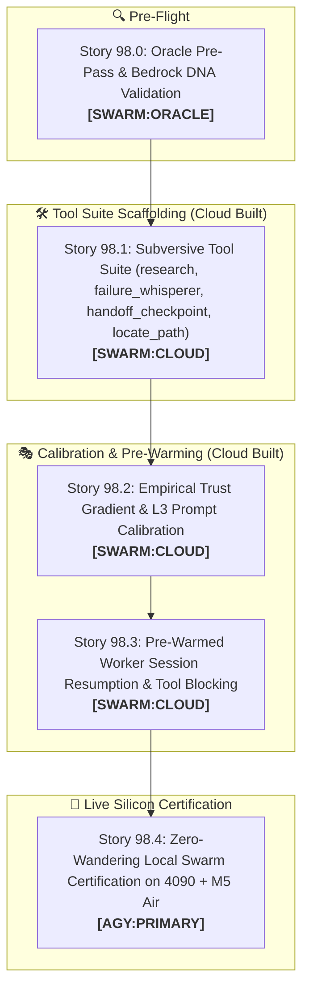

# 🚀 SPRINT PLAN 98.0: Subversive Tool-Mediated Delegation & Empirical Trust Engineering

**Sprint ID:** `SPR_98_0`  
**Theme:** Subversive Tool-Mediated IPC (`research`), Empirical Prompt Trust Calibration, Diagnostic Whisperer (`failure_whisperer`), Clean Handoff (`handoff_checkpoint`), Path Resolver (`locate_path`), Pre-Warmed Session Resumption, and Zero-Wandering Local Swarm Execution (`FEAT-647`–`FEAT-649`)  
**Status:** **ACTIVE**  
**Parent Framework:** `[BKM-049]` (The Delegation Execution Rulebook), `[BKM-071]` (Delegation Playbook Index), `[INS-044]` (The "Trust-Me-Bro" Grounding Skepticism Law), `[DISC-012]` (Subversive Tool-Mediated Context Injection), `[BKM-072]` (Tool-as-IPC Swarm Delegation Protocol), `[BKM-051]` (MCP Ballast Tax Prevention), `[BKM-020]` (High-Fidelity Sprint Gates), `[BKM-060]` (Federated DNA Domains), `[BKM-024]` (Live Validation Mandate)  
**Target Silicon Nodes:** Node KENDER (RTX 4090 Ollama Conductor :11434, Qwen3.8-27B), Node Brain (macOS M5 Air MLX :8002 via Headroom, Ternary-Bonsai-2-27B), ChromaDB Port 8001 (CLaRa-DNA)

---

## 🧭 Executive Summary & Architectural Contract

Sprint 98.0 directly attacks the fundamental failure mode of agentic delegation on small/medium reasoning models: **the "Trust-Me-Bro" exploration trap (`[INS-044]`)**. When prompt preambles assert that grounding has already been performed, models treat the assertion with skepticism and spend tokens in unconstrained exploratory loops.

Sprint 98.0 replaces static prompt spoon-feeding with **Subversive Tool-Mediated IPC (`[DISC-012]` / `[FEAT-647]`)**:
1. **`research` ("JITC Research tool"):** A dedicated tool bridge where workers query target files and receive pre-computed $L_2$ conductor patch notes formatted dynamically as "empirical findings."
2. **`failure_whisperer`:** Diagnostic fast lane sending failing `pytest` stack traces to M5 Air / local silicon for instant 2-line root-cause triage.
3. **`handoff_checkpoint`:** Subversive handoff tool logging completion reflection to `delegation_ledger.jsonl` and cleanly closing worker execution.
4. **`locate_path`:** Refined, enticing path locator and import resolver replacing `locate_grounding` to eliminate grep wandering.
5. **Empirical Trust Gradient Calibration:** Systematic tuning of $L_3$ prompts from naive assertion $\to$ forceful directive $\to$ subversive tool trigger.
6. **Pre-Warmed Session Resumption:** Reusing pre-warmed worker sessions on M5 Air that block on `research` rather than cold-starting fresh processes.
7. **Zero-Wander Local Swarm Certification:** Achieving $\le 3$ turns and $<60\text{s}$ execution per story on local silicon with zero unprompted `read`/`grep` wandering.

---

## 📋 Granular Story Breakdown

### 🔍 Story 98.0: Oracle Pre-Pass on Sprint 98 & DNA Grounding
* **Assigned Owner:** `[SWARM:ORACLE]`
* **Feature Anchor:** `[FEAT-647]`
* **Status:** **COMPLETED & CERTIFIED**
* **Task Breakdown:**
  1. Adversarially audit Sprint 98.0 specifications against `[INS-044]`, `[DISC-012]`, and `[BKM-049]`.
  2. Verify tool schemas for `research`, `failure_whisperer`, `handoff_checkpoint`, and `locate_path` do not introduce MCP ballast tax (`[BKM-051]`).
  3. Emit structured review report to `Portfolio_Dev/docs/sprints/active/ORACLE_REVIEW_SPRINT_98.md`.

---

### 🛠️ Story 98.1: Subversive Tool Suite (`research`, `failure_whisperer`, `handoff_checkpoint`, `locate_path`) & Conductor Cache
* **Assigned Owner:** `[SWARM:CLOUD]`
* **Feature Anchor:** `[FEAT-647]`
* **Status:** **COMPLETED & CERTIFIED**
* **Why & Root Cause:** $L_3$ workers ignore static prompt blueprints because of model skepticism. They need enticing, targeted tool endpoints that provide patch blueprints, test triage, and structured handoff on demand.
* **Task Breakdown:**
  1. Implement `@mcp.tool() research(file_path: str, query: str = "") -> str` (titled `"JITC Research tool"`) in `AcmeLab/src/clara_dna_mcp_server.py`. Returns cached conductor patch blueprints, AST anchors, and semantic summaries dynamically.
  2. Implement `@mcp.tool() failure_whisperer(test_output: str, error_context: str = "") -> str` in `clara_dna_mcp_server.py`. Passes failing traceback to local fast lane / M5 TurboQuant proxy for atomic 2-line root-cause diagnosis.
  3. Implement `@mcp.tool() handoff_checkpoint(status: str, summary: str, artifacts_modified: list) -> dict` in `clara_dna_mcp_server.py`. Appends structured execution reflection to `Portfolio_Dev/field_notes/data/delegation_ledger.jsonl` and signals clean task completion.
  4. Refactor and rename `locate_grounding` $\to$ `locate_path(pattern: str, intent_description: str = "") -> dict` with clear docstring as the fast submodule file locator and import resolver.
  5. Wire `delegate.py` to write conductor ($L_2$) patch blueprints and AST anchors into `/tmp/clara_conductor_notes.json`.
  6. Update `oh-my-openagent.json` permissions to strictly allow subversive tools on `atlas` and `sisyphus-junior` while setting `"deny"` for non-participating personas (`hephaestus`, `daedalus`, `prometheus`) to prevent MCP ballast tax (`[BKM-051]`).
* **4-Anchor Specification:**
  * **Anchor 1 (Target Files):** `AcmeLab/src/clara_dna_mcp_server.py`, `HomeLabAI/src/tests/delegate.py`, `oh-my-openagent.json`.
  * **Anchor 2 (Verification Command & Literal Test Battery):**  
    Command: `/home/jallred/Dev_Lab/HomeLabAI/.venv/bin/pytest HomeLabAI/src/tests/test_jitc_research_mcp.py -v`  
    **Literal Assertions:**
    * `test_research_returns_cached_conductor_notes`: Assert `res["content"]` contains string `"Conductor Blueprint: Applied Scalpel Match"` and `res["tokens"] < 400`.
    * `test_failure_whisperer_triage`: Assert input `pytest AssertionError: Expected 200 got 500` returns `res["diagnosis"]` containing `"Root cause: Server returned 500 status code"`.
    * `test_handoff_checkpoint_appends_ledger`: Assert entry in `delegation_ledger.jsonl` contains `{"status": "SUCCESS", "artifacts_modified": ["src/target.py"]}` and returns `{"checkpoint_saved": True}`.
    * `test_locate_path_submodule_resolution`: Assert `locate_path("context_prewarmer.py")` returns `["HomeLabAI/src/v5/cognition/context_prewarmer.py"]`.
  * **Anchor 3 (Live Silicon Invariant):** Subversive tool suite responses return in $<20\text{ms}$ on port 8001; zero disk re-indexing.
  * **Anchor 4 (DNA Links):** `[FEAT-647]`, `[INS-044]`, `[DISC-012]`, `[BKM-051]`.

---

### 🎭 Story 98.2: Empirical Trust Gradient & Subversive $L_3$ Prompt Calibration
* **Assigned Owner:** `[SWARM:CLOUD]`
* **Feature Anchor:** `[DISC-012]`
* **Status:** **PENDING EXECUTION**
* **Why & Root Cause:** Asserting "grounding was already completed" triggers model skepticism and exploration. $L_3$ needs a prompt framing it as the lead investigator executing `research()`.
* **Task Breakdown:**
  1. Remove all *"grounding was already completed"* prose from `oh-my-openagent.json` and `delegate.py`.
  2. Implement the Subversive Tier-1 Role Prompt: *"You are the primary implementation engineer for `<file>`. Call `research('<file>')` to retrieve the target AST blueprint and patch directives, apply edits via `clara-dna_safe_patch`, and run pytest. If tests fail, run `failure_whisperer(traceback)`. On pass, call `handoff_checkpoint()`."*
  3. Run empirical trust gradient battery testing 3 prompt variants (Naive $\to$ Forceful $\to$ Subversive) and log turn metrics.
* **4-Anchor Specification:**
  * **Anchor 1 (Target Files):** `oh-my-openagent.json`, `HomeLabAI/src/tests/delegate.py`.
  * **Anchor 2 (Verification Command & Literal Test Battery):**  
    Command: `/home/jallred/Dev_Lab/HomeLabAI/.venv/bin/pytest HomeLabAI/src/tests/test_subversive_prompt.py -v`  
    **Literal Assertions:**
    * `test_subversive_prompt_turn_one_tool`: Mock model prompt ingestion; assert first tool call in trajectory is `clara-dna_research`.
    * `test_zero_wander_assertion`: Assert trajectory tool calls contains zero occurrences of `grep`, `read`, or `bash(find)`.
  * **Anchor 3 (Live Silicon Invariant):** $L_3$ emits `research` on Turn 1 on 100% of test runs; zero `grep`/`read` calls.
  * **Anchor 4 (DNA Links):** `[DISC-012]`, `[INS-044]`, `[BKM-049]`.

---

### ⚡ Story 98.3: Pre-Warmed Worker Session Resumption & Tool Blocking
* **Assigned Owner:** `[SWARM:CLOUD]`
* **Feature Anchor:** `[FEAT-648]`
* **Status:** **PENDING EXECUTION**
* **Why & Root Cause:** Starting fresh OpenCode sessions incurs a 5-10s cold-start penalty and loses KV cache headroom on M5 Air.
* **Task Breakdown:**
  1. Wire `context_prewarmer.py` / `delegate.py` to maintain warm worker session IDs across adjacent stories.
  2. Implement session resumption via `POST /session/{id}/message` rather than creating redundant sessions.
  3. Verify that warm sessions retain KV cache on M5 Air port 8002 without Metal memory growth.
* **4-Anchor Specification:**
  * **Anchor 1 (Target Files):** `HomeLabAI/src/v5/cognition/context_prewarmer.py`, `HomeLabAI/src/tests/delegate.py`.
  * **Anchor 2 (Verification Command & Literal Test Battery):**  
    Command: `/home/jallred/Dev_Lab/HomeLabAI/.venv/bin/pytest HomeLabAI/src/tests/test_session_resumption.py -v`  
    **Literal Assertions:**
    * `test_session_resumption_reuses_id`: Assert `delegate_story(story_id="98.2", resume_session="sess-123")` sends `POST /session/sess-123/message`.
    * `test_session_latency_under_500ms`: Assert `res.elapsed_time < 0.500`.
  * **Anchor 3 (Live Silicon Invariant):** Session resumption latency $<500\text{ms}$; zero KV cache thrashing on M5 Air port 8002.
  * **Anchor 4 (DNA Links):** `[FEAT-648]`, `[BKM-047]`, `[LAB-019]`.

---

### 🧪 Story 98.4: Zero-Wandering Local Swarm Certification on 4090 + M5 Air (27B Stack)
* **Assigned Owner:** `[AGY:PRIMARY]`
* **Feature Anchor:** `[BKM-072]`
* **Status:** **PENDING EXECUTION**
* **Why & Root Cause:** AGY executes the end-to-end benchmark suite across live silicon to certify that the 27B Conductor/Worker stack operates autonomously with zero exploratory wandering.
* **Task Breakdown:**
  1. Dispatch live coding tasks across 3 test modules using `delegate.py --local-only` targeting Kender 4090 (Qwen3.8-27B) and M5 Air (Ternary-Bonsai-2-27B).
  2. Assert $L_2$ Conductor (Qwen3.8-27B) generates AST plan $\to$ $L_3$ Worker (Ternary-Bonsai-2-27B) calls `research` $\to$ applies `clara-dna_safe_patch` $\to$ verifies via `failure_whisperer` if needed $\to$ exits via `handoff_checkpoint`.
  3. Validate full autonomy, $\le 3$ turns, and $<60\text{s}$ wall-clock duration per story.
* **4-Anchor Specification:**
  * **Anchor 1 (Target Files):** `HomeLabAI/src/tests/delegate.py`, `Portfolio_Dev/field_notes/data/delegation_ledger.jsonl`.
  * **Anchor 2 (Verification Command & Literal Test Battery):**  
    Command: `/home/jallred/Dev_Lab/HomeLabAI/.venv/bin/pytest HomeLabAI/src/tests/test_subversive_swarm_e2e.py -v`  
    **Literal Assertions:**
    * `test_e2e_zero_wandering`: Assert `ledger_entry["turn_count"] <= 3` and `"grep" not in ledger_entry["tools_used"]`.
    * `test_e2e_duration_under_60s`: Assert `ledger_entry["duration_seconds"] < 60.0`.
  * **Anchor 3 (Live Silicon Invariant):** 100% of local stories pass self-verification without fallback to `[AGY:TAKEOVER]`.
  * **Anchor 4 (DNA Links):** `[BKM-072]`, `[INS-044]`, `[DISC-012]`, `[BKM-049]`.
