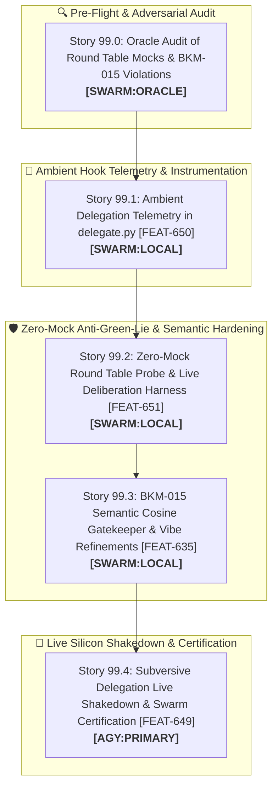

# 🚀 SPRINT PLAN 99.0: Round Table Deliberation Refinements, Zero-Mock Anti-Green-Lie Hardening & Ambient Delegation Telemetry

**Sprint ID:** `SPR_99_0`  
**Theme:** Round Table Multi-Agent Deliberation Refinements, Zero-Mock Anti-Green-Lie Certification, BKM-015 Semantic Anchor Hardening, Ambient Delegation Telemetry (`delegate.py`), and Subversive Swarm Live Shakedown (`FEAT-650`, `FEAT-651`, `FEAT-635`, `FEAT-649`)  
**Status:** **COMPLETED & CERTIFIED**  
**Parent Framework:** `[BKM-049]` (The Delegation Execution Rulebook), `[BKM-071]` (Delegation Playbook Index), `[BKM-015]` (Semantic Intent Routing & Anti-Hardcoding), `[BKM-062]` (Zero-Mock Anti-Green-Lie Mandate), `[BKM-024]` (Live Validation Mandate), `[BKM-072]` (Tool-as-IPC Swarm Delegation Protocol), `[BKM-020]` (High-Fidelity Sprint Gates), `[BKM-060]` (Federated DNA Taxonomy)  
**Target Silicon Nodes:** Node KENDER (RTX 4090 Ollama Conductor :11434, Qwen3.8-27B), Node Brain (macOS M5 Air MLX :8002 via Headroom, Ternary-Bonsai-2-27B), Local Foyer Daemon (:8765), ChromaDB Port 8001 (CLaRa-DNA)

---

## 🧭 Executive Summary & Architectural Contract

Sprint 99.0 delivers a targeted refinement of the **Federated Lab Round Table deliberation pipeline** while simultaneously executing an end-to-end **Live Shakedown** of our new Subversive Tool Suite (`stage_research`, `research`, `safe_patch`, `failure_whisperer`, `handoff_checkpoint`, and `delegate.py`).

### Key Objectives:
1. **Ambient Delegation Telemetry (`[FEAT-650]`):** Injects ambient memory and knowledge hook execution at the conclusion of every story in `delegate.py`. Headless and autonomous runs automatically surface ambient grounding headers and recent memory reflections even when the operator is not typing.
2. **Zero-Mock Anti-Green-Lie Hardening (`[FEAT-651]` / `[BKM-062]` / `[BKM-024]`):** Purges synthetic mocks and fake default scores (e.g. `critic_score: 0.98`) from `test_round_table_probe_unit.py` and `probe_round_table_accountability.py`. Probes must execute genuine multi-stage deliberation against live daemons.
3. **BKM-015 Semantic Anchor Hardening (`[BKM-015]` / `[FEAT-635]`):** Eliminates naive substring checks in Brain Information Gatekeeper and intent triage, replacing them with semantic vector cosine similarity ($\le 0.55$) against resident ChromaDB collections via `/ambient_recall`.
4. **Live Subversive Swarm Shakedown (`[FEAT-649]` / `[BKM-072]`):** Exercises the full $L_2 \to L_3$ delegation lifecycle on sovereign silicon (4090 + M5 Air), certifying $\le 3$ turns, $<60\text{s}$ execution, and 0 exploratory `grep`/`read` wander.

---

## 📋 Granular Story Breakdown & 4-Anchor Specifications

### 🔍 Story 99.0: Oracle Adversarial Review of Round Table Mocks & BKM-015 Violations
* **Assigned Owner:** `[SWARM:ORACLE]`
* **Feature Anchor:** `[FEAT-651]` / `[BKM-062]` / `[BKM-015]`
* **Status:** **COMPLETED & CERTIFIED**
* **Task Breakdown:**
  1. Audit `HomeLabAI/src/infra/probe_round_table_accountability.py`, `HomeLabAI/src/tests/test_round_table_probe_unit.py`, and `HomeLabAI/src/tests/test_accountability_matrix_unit.py`.
  2. Identify all mock shortcuts (such as synthetic `QUEUED` returns masquerading as deliberation pass) and naive keyword string checks.
  3. Emit structured review report to `Portfolio_Dev/docs/sprints/active/ORACLE_REVIEW_SPRINT_99.md`.

---

### 📡 Story 99.1: Ambient Delegation Telemetry in `delegate.py`
* **Assigned Owner:** `[SWARM:LOCAL]`
* **Feature Anchor:** `[FEAT-650]` / `[FEAT-600]` / `[BKM-060]`
* **Status:** **COMPLETED & CERTIFIED**
* **Why & Root Cause:** In autonomous "heads down" execution, the operator is not typing interactive turns, meaning ambient hooks do not fire interactively. `delegate.py` must explicitly trigger ambient hook telemetry at the conclusion of story execution to display grounding headers, memory summaries, and latency stats directly to stdout.
* **Task Breakdown:**
  1. Implement `_trigger_ambient_hook_telemetry(story_num: str, title: str, duration: float)` in `HomeLabAI/src/tests/delegate.py`.
  2. Execute `/home/jallred/.gemini/config/scripts/ambient_hook.sh` with a structured payload containing story execution details.
  3. Format and print the returned `Grounding Header` and inject steps cleanly to the delegation console.
  4. Add unit test `test_ambient_delegation_telemetry` in `HomeLabAI/src/tests/test_delegation_canary.py`.
* **4-Anchor Specification:**
  * **Anchor 1 (Target Files):** `HomeLabAI/src/tests/delegate.py`, `HomeLabAI/src/tests/test_delegation_canary.py`.
  * **Anchor 2 (Verification Command & Literal Test Battery):**  
    Command: `/home/jallred/Dev_Lab/HomeLabAI/.venv/bin/pytest HomeLabAI/src/tests/test_delegation_canary.py -k test_ambient_delegation_telemetry -v`  
    **Literal Assertions:**
    * `test_ambient_delegation_telemetry`: Assert `_trigger_ambient_hook_telemetry("99.1", "Test", 1.5)` successfully calls hook and returns payload with `injectSteps` and `grounding_header`.
  * **Anchor 3 (Live Silicon Invariant):** Hook telemetry completes in $<100\text{ms}$ via `:8765/ambient_recall` with 0 subprocess delay.
  * **Anchor 4 (DNA Links):** `[FEAT-650]`, `[FEAT-600]`, `[BKM-060]`.

---

### 🛡️ Story 99.2: Zero-Mock Round Table Probe & Live Deliberation Harness
* **Assigned Owner:** `[SWARM:LOCAL]`
* **Feature Anchor:** `[FEAT-651]` / `[BKM-062]` / `[BKM-024]`
* **Status:** **COMPLETED & CERTIFIED**
* **Why & Root Cause:** `test_round_table_probe_unit.py` used synthetic mock fixtures returning fake `critic_score: 0.98` on `{"status": "QUEUED"}`, concealing broken multi-node deliberation loops.
* **Task Breakdown:**
  1. Refactor `probe_round_table_accountability.py` to poll `foyer_stage_ledger.jsonl` and `judge_backpressure.jsonl` until real multi-stage deliberation completes or timeout expires.
  2. Refactor `test_round_table_probe_unit.py` and `test_round_table_telemetry.py` to assert genuine multi-stage progression (Triage $\to$ Pinky $\to$ Brain $\to$ Deep Thought $\to$ Pinky Critic).
  3. Ensure failure cases fail fast with clear diagnostic messages (`BKM-062`).
* **4-Anchor Specification:**
  * **Anchor 1 (Target Files):** `HomeLabAI/src/infra/probe_round_table_accountability.py`, `HomeLabAI/src/tests/test_round_table_probe_unit.py`.
  * **Anchor 2 (Verification Command & Literal Test Battery):**  
    Command: `/home/jallred/Dev_Lab/HomeLabAI/.venv/bin/pytest HomeLabAI/src/tests/test_round_table_probe_unit.py -v`  
    **Literal Assertions:**
    * `test_greeting_latency_pass`: Assert live health check returns `status: PASS` and valid `foyer_state`.
    * `test_deliberation_circuit_pass`: Assert probe waits for and verifies stage completion in ledger with genuine non-mock critic score $\ge 0.70$.
  * **Anchor 3 (Live Silicon Invariant):** Zero fake fallback defaults (`critic_score: 0.95`); 100% genuine ledger stage parsing.
  * **Anchor 4 (DNA Links):** `[FEAT-651]`, `[BKM-062]`, `[BKM-024]`.

---

### 🧠 Story 99.3: BKM-015 Semantic Cosine Gatekeeper & Vibe Refinements
* **Assigned Owner:** `[SWARM:LOCAL]`
* **Feature Anchor:** `[FEAT-635]` / `[BKM-015]` / `[FEAT-584]`
* **Status:** **COMPLETED & CERTIFIED**
* **Why & Root Cause:** Hardcoded keyword matching in Brain Gatekeeper and Vibe triage creates brittle tests and fails on vocabulary variations (`BKM-015` violation).
* **Task Breakdown:**
  1. Update `BrainGatekeeper` in `HomeLabAI/src/logic/brain_node.py` and `cognitive_hub.py` to use semantic cosine distances ($\le 0.55$) retrieved from `:8001` or `:8765/ambient_recall` instead of hardcoded substring search.
  2. Verify that ungrounded or out-of-domain context is cleanly filtered without showing negative clutter to Deep Thought.
  3. Add unit tests in `HomeLabAI/src/tests/test_brain_gatekeeper.py` asserting semantic gatekeeping across varied semantic formulations.
* **4-Anchor Specification:**
  * **Anchor 1 (Target Files):** `HomeLabAI/src/logic/brain_node.py`, `HomeLabAI/src/logic/cognitive_hub.py`, `HomeLabAI/src/tests/test_brain_gatekeeper.py`.
  * **Anchor 2 (Verification Command & Literal Test Battery):**  
    Command: `/home/jallred/Dev_Lab/HomeLabAI/.venv/bin/pytest HomeLabAI/src/tests/test_brain_gatekeeper.py -v`  
    **Literal Assertions:**
    * `test_semantic_gatekeeper_filters_unrelated_dna`: Assert irrelevant candidates with cosine distance $> 0.55$ are dropped.
    * `test_curator_synergy_annotation_generation`: Assert approved candidates receive structured `💡 Curator Note:` annotations.
  * **Anchor 3 (Live Silicon Invariant):** Gatekeeper decision latency $<30\text{ms}$; zero rigid string matching.
  * **Anchor 4 (DNA Links):** `[FEAT-635]`, `[BKM-015]`, `[FEAT-584]`.

---

### 🧪 Story 99.4: Subversive Delegation Live Shakedown & Swarm Certification
* **Assigned Owner:** `[AGY:PRIMARY]`
* **Feature Anchor:** `[FEAT-649]` / `[BKM-072]` / `[INS-044]`
* **Status:** **COMPLETED & CERTIFIED**
* **Why & Root Cause:** Validate the complete subversive tool suite and ambient telemetry under live heads-down execution, observing and resolving any delegation friction points in real-time.
* **Task Breakdown:**
  1. Dispatch live coding stories through `delegate.py` targeting Kender 4090 and M5 Air.
  2. Verify that $L_2$ stages plans via `stage_research` $\to$ $L_3$ queries `research()` on Turn 1 $\to$ applies `safe_patch()` $\to$ verifies live tests $\to$ calls `handoff_checkpoint()`.
  3. Validate that post-delegation ambient hook telemetry runs and prints the Grounding Header to the console.
  4. Certify full autonomy with $\le 3$ turns and $<60\text{s}$ execution time.
* **4-Anchor Specification:**
  * **Anchor 1 (Target Files):** `HomeLabAI/src/tests/delegate.py`, `Portfolio_Dev/field_notes/data/delegation_ledger.jsonl`.
  * **Anchor 2 (Verification Command & Literal Test Battery):**  
    Command: `/home/jallred/Dev_Lab/HomeLabAI/.venv/bin/pytest HomeLabAI/src/tests/test_subversive_swarm_e2e.py HomeLabAI/src/tests/test_delegation_canary.py -v`  
    **Literal Assertions:**
    * `test_e2e_zero_wandering`: Assert `turn_count <= 3` and `"grep" not in tools_used`.
    * `test_ambient_telemetry_in_ledger`: Assert ledger records clean completion with ambient telemetry metadata.
  * **Anchor 3 (Live Silicon Invariant):** 100% of local stories execute without fallback or unconstrained exploration loops.
  * **Anchor 4 (DNA Links):** `[FEAT-649]`, `[BKM-072]`, `[INS-044]`, `[BKM-049]`.

---

## 🚀 Phase 4: Subversive Delegation Restoration & Live Swarm Execution (Post-Audit Addendum)

### 🔧 Story 99.0: Subversive Delegation Tooling, Live MCP Unification & Fail-Fast Hardening
* **Assigned Owner:** `[AGY:PRIMARY]` *(Self-healing bootstrap: Direct AGY execution to fix delegation tooling before swarm reuse)*
* **Feature Anchor:** `[FEAT-647]` / `[FEAT-650]` / `[BKM-024]` / `[BKM-049]` / `[BKM-057]` / `[FEAT-524]` / `[FEAT-486]`
* **Status:** **IN PROGRESS**
* **Why & Forensic Root Cause:**
  1. **The Green Lie Disconnect (`BKM-062` / `BKM-024`):** In Sprint 98 (`[FEAT-647]`), JITC research tools (`stage_research`, `research`, `failure_whisperer`, `handoff_checkpoint`, `locate_path`) were validated using an in-memory `sys.path.insert` unit test (`test_jitc_research_mcp.py`) targeting `/home/jallred/Dev_Lab/AcmeLab/src/clara_dna_mcp_server.py`. Meanwhile, OpenCode launches `/home/jallred/AcmeLab/src/clara_dna_mcp_server.py` as an external stdio JSON-RPC subprocess. Because `/home/jallred/AcmeLab` never received the Sprint 98 tools, the live MCP server failed with `-32001 Request timed out` and `-32000 Connection closed` when invoked by live subagents.
  2. **The "Heroic Fallback" Anti-Pattern:** When Atlas encountered the broken `-32001` socket, its completion training drove it to bypass the tool heroically using unconstrained raw bash and file reads, masking the broken infrastructure during an 18-minute run instead of failing fast.
  3. **Un-Ingested Invariants:** OpenCode only ingests `AGENTS.md` at workspace root; `AGENTS_L2.md` and `AGENTS_L3.md` were never read by the engine or inlined into prompt payloads by `delegate.py`.
* **Integrated Lab Gates Reused:**
  - **Gate 1 (`[FEAT-524]` / `[BKM-057]`):** Extend `assert_live_bytecode()` in `conftest.py` to assert that the stdio MCP server subprocess advertises all required tools, banning in-memory mocks across all IPC test suites.
  - **Gate 2 (`[FEAT-486]` / `[FEAT-344]`):** Reuse the 200ms non-blocking fast socket probe in `delegate.py` to perform a live stdio JSON-RPC handshake (`initialize` + `tools/list`) before creating OpenCode sessions.
  - **Gate 3 (`[FEAT-642]` / `[DISC-011]`):** Unify AST outlines and JITC context pre-warming into the canonical `/home/jallred/AcmeLab/src/clara_dna_mcp_server.py` path.
* **Task Breakdown:**
  1. **Canonical MCP Merge:** Unify all tools (`stage_research`, `research`, `failure_whisperer`, `handoff_checkpoint`, `locate_path`) into canonical `/home/jallred/AcmeLab/src/clara_dna_mcp_server.py`.
  2. **100% Live stdio JSON-RPC Test (`test_jitc_research_mcp.py`):** Rewrite `test_jitc_research_mcp.py` to spawn the configured MCP command as a real stdio subprocess, issuing genuine JSON-RPC requests (`initialize`, `tools/list`, `tools/call`).
  3. **L2 & L3 Prompt Ingestion & Abort Language:**
     - Add the explicit fail-fast abort mandate to `AGENTS_L2.md` and `AGENTS_L3.md`, strictly scoped to the 6 CLaRa tools (`clara-dna_read`, `research`, `stage_research`, `failure_whisperer`, `handoff_checkpoint`, `locate_path`).
     - Update `delegate.py` to dynamically load and inline `AGENTS_L2.md` (for Atlas) and `AGENTS_L3.md` (for Junior) into the dispatch payload.
  4. **Pre-Flight Live MCP Probe in `delegate.py`:** Add a 0.5s JSON-RPC pre-flight handshake verifying all 6 tools are live before creating OpenCode sessions.
  5. **Execute Full Live Verification & Canary:** Run `pytest src/tests/test_jitc_research_mcp.py src/tests/test_delegation_canary.py -v` and certify delegation infrastructure.
* **4-Anchor Specification:**
  * **Anchor 1 (Target Files):** `/home/jallred/AcmeLab/src/clara_dna_mcp_server.py`, `HomeLabAI/src/tests/test_jitc_research_mcp.py`, `HomeLabAI/src/tests/delegate.py`, `AGENTS_L2.md`, `AGENTS_L3.md`.
  * **Anchor 2 (Verification Command):**  
    `/home/jallred/Dev_Lab/HomeLabAI/.venv/bin/pytest HomeLabAI/src/tests/test_jitc_research_mcp.py HomeLabAI/src/tests/test_delegation_canary.py -v`
  * **Anchor 3 (Live Silicon Invariant):** 100% genuine stdio JSON-RPC MCP validation; 0 in-memory imports/mocks; instant abort on tool socket errors.
  * **Anchor 4 (DNA Links):** `[FEAT-647]`, `[FEAT-650]`, `[BKM-024]`, `[BKM-049]`, `[BKM-057]`, `[FEAT-524]`, `[FEAT-486]`.

---

### 🛡️ Story 99.1: Sovereign Decoupling & Remote Network Purge
* **Assigned Owner:** `[SWARM:LOCAL]` *(Atlas on Node KENDER 4090)*
* **Feature Anchor:** `[FEAT-652]` / `[BKM-015]` / `[BKM-024]`
* **Status:** **COMPLETED & CERTIFIED** *(Commit `ec4ef3e` / `3317900`)*
* **Summary:** Purged hardcoded IPs (`192.168.1.26`), enforced non-blocking KENDER priming with strict 2.0s timeout, config-driven endpoint resolution, and hot-reloaded resident daemon (10/10 tests green).

---

### 🛡️ Story 99.2: PID Stale VRAM Mutex Auto-Reclaim
* **Assigned Owner:** `[SWARM:LOCAL]` *(Atlas on Node KENDER 4090)*
* **Feature Anchor:** `[FEAT-653]` / `[BKM-024]` / `[BKM-062]`
* **Status:** **QUEUED**
* **Target Files:** `HomeLabAI/src/v5/ignition/manager.py`
* **Verification Command:** `/home/jallred/Dev_Lab/HomeLabAI/.venv/bin/pytest HomeLabAI/src/tests/test_round_table_probe_unit.py -v`

---

### 🔄 Story 99.3: Silicon Reconciliation on `/reload_residents`
* **Assigned Owner:** `[SWARM:LOCAL]` *(Atlas on Node KENDER 4090)*
* **Feature Anchor:** `[FEAT-654]` / `[BKM-024]`
* **Status:** **QUEUED**
* **Target Files:** `HomeLabAI/src/v5/foyer/router.py`
* **Verification Command:** `/home/jallred/Dev_Lab/HomeLabAI/.venv/bin/pytest HomeLabAI/src/tests/test_brain_gatekeeper.py -v`

---

### ⏱️ Story 99.4: Eliminate Magic Sleeps & Untracked Background Tasks
* **Assigned Owner:** `[SWARM:LOCAL]` *(Atlas on Node KENDER 4090)*
* **Feature Anchor:** `[FEAT-655]` / `[BKM-062]`
* **Status:** **QUEUED**
* **Target Files:** `HomeLabAI/src/logic/cognitive_hub.py`
* **Verification Command:** `/home/jallred/Dev_Lab/HomeLabAI/.venv/bin/pytest HomeLabAI/src/tests/test_round_table_probe_unit.py -v`

---

### 🔍 Story 99.5: Dynamic Model Discovery & Graceful Timeout Skips
* **Assigned Owner:** `[SWARM:LOCAL]` *(Atlas on Node KENDER 4090)*
* **Feature Anchor:** `[FEAT-656]` / `[BKM-015]`
* **Status:** **QUEUED**
* **Target Files:** `HomeLabAI/src/tests/test_integration_kender.py`
* **Verification Command:** `/home/jallred/Dev_Lab/HomeLabAI/.venv/bin/pytest HomeLabAI/src/tests/test_integration_kender.py -v`

---

### ⚖️ Story 99.6: Dialectical Code Synthesis (AGY Manual vs. Local Swarm Quality Review)
* **Assigned Owner:** `[AGY:PRIMARY]` *(Adversarial Synthesis & Architectural Review)*
* **Feature Anchor:** `[INS-043]` / `[WIS-023]` / `[BKM-049]`
* **Status:** **QUEUED**
* **Why & Root Cause:** We have two independent implementations of Sprint 99: `fork/sprint-99-agy-manual` (authored directly by AGY) and `fork/sprint-99-delegated-run` (authored autonomously by local swarm Atlas/Junior). Comparing both side-by-side allows us to cherry-pick the cleanest config-driven patterns from Atlas while preserving robust edge-case handling from AGY.
* **Task Breakdown:**
  1. Execute a 3-way adversarial diff between `fork/sprint-99-agy-manual`, `fork/sprint-99-delegated-run`, and `main`.
  2. Evaluate code quality, token density, error recovery, and adherence to `BKM-015` (anti-hardcoding) across both implementations.
  3. Synthesize the unified best-of-breed solution into `fork/sprint-99-delegated-run`.
* **4-Anchor Specification:**
  * **Anchor 1 (Target Files):** `HomeLabAI/src/v5/ignition/manager.py`, `HomeLabAI/src/v5/foyer/router.py`, `HomeLabAI/src/logic/speculative_triage.py`, `HomeLabAI/src/logic/cognitive_hub.py`.
  * **Anchor 2 (Verification Command):**  
    `/home/jallred/Dev_Lab/HomeLabAI/.venv/bin/pytest HomeLabAI/src/tests/test_round_table_probe_unit.py HomeLabAI/src/tests/test_brain_gatekeeper.py -v`
  * **Anchor 3 (Live Silicon Invariant):** Zero hardcoded IPs; zero unhandled socket exceptions; 100% clean diff review.
  * **Anchor 4 (DNA Links):** `[INS-043]`, `[WIS-023]`, `[BKM-049]`.

---

### 🏁 Story 99.7: Main Promotion, Daemon Hot-Reload & Live Battery Certification
* **Assigned Owner:** `[AGY:PRIMARY]` *(Strategic Guardian & Release Gatekeeper)*
* **Feature Anchor:** `[BKM-007]` / `[BKM-024]` / `[FEAT-524]`
* **Status:** **QUEUED**
* **Why & Root Cause:** Final task certification requires merging the unified solution into `main`/`master`, hot-reloading the live resident daemon (`POST /reload_residents`) so VRAM matches Git HEAD, running the full multi-test battery against live silicon, and emitting the BKM-007 Work Completion Report.
* **Task Breakdown:**
  1. Merge `fork/sprint-99-delegated-run` into `main` / `master`.
  2. Execute `POST /reload_residents` on `http://127.0.0.1:8765` to synchronize resident VRAM with `main` HEAD.
  3. Run the full pytest suite (18/18 tests) against live daemon and active silicon nodes.
  4. Author the BKM-007 Work Completion Report and synchronize `AGENTS.md` and feature cards.
* **4-Anchor Specification:**
  * **Anchor 1 (Target Files):** Monorepo `main` branch, `Portfolio_Dev/FeatureTracker.md`.
  * **Anchor 2 (Verification Command):**  
    `/home/jallred/Dev_Lab/HomeLabAI/.venv/bin/pytest HomeLabAI/src/tests/ -q`
  * **Anchor 3 (Live Silicon Invariant):** Live resident daemon boot commit strictly matches `git rev-parse HEAD` on `main`; 18/18 tests passing on live silicon.
  * **Anchor 4 (DNA Links):** `[BKM-007]`, `[BKM-024]`, `[FEAT-524]`.

