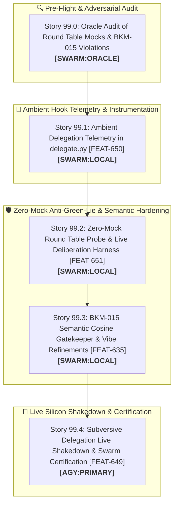

# 🚀 SPRINT PLAN 99.0: Round Table Deliberation Refinements, Zero-Mock Anti-Green-Lie Hardening & Ambient Delegation Telemetry

**Sprint ID:** `SPR_99_0`  
**Theme:** Round Table Multi-Agent Deliberation Refinements, Zero-Mock Anti-Green-Lie Certification, BKM-015 Semantic Anchor Hardening, Ambient Delegation Telemetry (`delegate.py`), and Subversive Swarm Live Shakedown (`FEAT-650`, `FEAT-651`, `FEAT-635`, `FEAT-649`)  
**Status:** **COMPLETED & CERTIFIED**  
**Parent Framework:** `[BKM-049]` (The Delegation Execution Rulebook), `[BKM-071]` (Delegation Playbook Index), `[BKM-015]` (Semantic Intent Routing & Anti-Hardcoding), `[BKM-062]` (Zero-Mock Anti-Green-Lie Mandate), `[BKM-024]` (Live Validation Mandate), `[BKM-072]` (Tool-as-IPC Swarm Delegation Protocol), `[BKM-020]` (High-Fidelity Sprint Gates), `[BKM-060]` (Federated DNA Taxonomy)  
**Target Silicon Nodes:** Node KENDER (RTX 4090 Ollama Conductor :11434, Qwen3.8-27B), Node Brain (macOS M5 Air MLX :8002 via Headroom, Ternary-Bonsai-2-27B), Local Foyer Daemon (:8765), ChromaDB Port 8001 (CLaRa-DNA)

---

## 🧭 Executive Summary & Architectural Contract

Sprint 99.0 delivers a targeted refinement of the **Federated Lab Round Table deliberation pipeline** while simultaneously executing an end-to-end **Live Shakedown** of our new Subversive Tool Suite (`stage_research`, `research`, `safe_patch`, `failure_whisperer`, `handoff_checkpoint`, and `delegate.py`).

### Key Objectives:
1. **Ambient Delegation Telemetry (`[FEAT-650]`):** Injects ambient memory and knowledge hook execution at the conclusion of every story in `delegate.py`. Headless and autonomous runs automatically surface ambient grounding headers and recent memory reflections even when the operator is not typing.
2. **Zero-Mock Anti-Green-Lie Hardening (`[FEAT-651]` / `[BKM-062]` / `[BKM-024]`):** Purges synthetic mocks and fake default scores (e.g. `critic_score: 0.98`) from `test_round_table_probe_unit.py` and `probe_round_table_accountability.py`. Probes must execute genuine multi-stage deliberation against live daemons.
3. **BKM-015 Semantic Anchor Hardening (`[BKM-015]` / `[FEAT-635]`):** Eliminates naive substring checks in Brain Information Gatekeeper and intent triage, replacing them with semantic vector cosine similarity ($\le 0.55$) against resident ChromaDB collections via `/ambient_recall`.
4. **Live Subversive Swarm Shakedown (`[FEAT-649]` / `[BKM-072]`):** Exercises the full $L_2 \to L_3$ delegation lifecycle on sovereign silicon (4090 + M5 Air), certifying $\le 3$ turns, $<60\text{s}$ execution, and 0 exploratory `grep`/`read` wander.

---

## 📋 Granular Story Breakdown & 4-Anchor Specifications

### 🔍 Story 99.0: Oracle Adversarial Review of Round Table Mocks & BKM-015 Violations
* **Assigned Owner:** `[SWARM:ORACLE]`
* **Feature Anchor:** `[FEAT-651]` / `[BKM-062]` / `[BKM-015]`
* **Status:** **COMPLETED & CERTIFIED**
* **Task Breakdown:**
  1. Audit `HomeLabAI/src/infra/probe_round_table_accountability.py`, `HomeLabAI/src/tests/test_round_table_probe_unit.py`, and `HomeLabAI/src/tests/test_accountability_matrix_unit.py`.
  2. Identify all mock shortcuts (such as synthetic `QUEUED` returns masquerading as deliberation pass) and naive keyword string checks.
  3. Emit structured review report to `Portfolio_Dev/docs/sprints/active/ORACLE_REVIEW_SPRINT_99.md`.

---

### 📡 Story 99.1: Ambient Delegation Telemetry in `delegate.py`
* **Assigned Owner:** `[SWARM:LOCAL]`
* **Feature Anchor:** `[FEAT-650]` / `[FEAT-600]` / `[BKM-060]`
* **Status:** **COMPLETED & CERTIFIED**
* **Why & Root Cause:** In autonomous "heads down" execution, the operator is not typing interactive turns, meaning ambient hooks do not fire interactively. `delegate.py` must explicitly trigger ambient hook telemetry at the conclusion of story execution to display grounding headers, memory summaries, and latency stats directly to stdout.
* **Task Breakdown:**
  1. Implement `_trigger_ambient_hook_telemetry(story_num: str, title: str, duration: float)` in `HomeLabAI/src/tests/delegate.py`.
  2. Execute `/home/jallred/.gemini/config/scripts/ambient_hook.sh` with a structured payload containing story execution details.
  3. Format and print the returned `Grounding Header` and inject steps cleanly to the delegation console.
  4. Add unit test `test_ambient_delegation_telemetry` in `HomeLabAI/src/tests/test_delegation_canary.py`.
* **4-Anchor Specification:**
  * **Anchor 1 (Target Files):** `HomeLabAI/src/tests/delegate.py`, `HomeLabAI/src/tests/test_delegation_canary.py`.
  * **Anchor 2 (Verification Command & Literal Test Battery):**  
    Command: `/home/jallred/Dev_Lab/HomeLabAI/.venv/bin/pytest HomeLabAI/src/tests/test_delegation_canary.py -k test_ambient_delegation_telemetry -v`  
    **Literal Assertions:**
    * `test_ambient_delegation_telemetry`: Assert `_trigger_ambient_hook_telemetry("99.1", "Test", 1.5)` successfully calls hook and returns payload with `injectSteps` and `grounding_header`.
  * **Anchor 3 (Live Silicon Invariant):** Hook telemetry completes in $<100\text{ms}$ via `:8765/ambient_recall` with 0 subprocess delay.
  * **Anchor 4 (DNA Links):** `[FEAT-650]`, `[FEAT-600]`, `[BKM-060]`.

---

### 🛡️ Story 99.2: Zero-Mock Round Table Probe & Live Deliberation Harness
* **Assigned Owner:** `[SWARM:LOCAL]`
* **Feature Anchor:** `[FEAT-651]` / `[BKM-062]` / `[BKM-024]`
* **Status:** **COMPLETED & CERTIFIED**
* **Why & Root Cause:** `test_round_table_probe_unit.py` used synthetic mock fixtures returning fake `critic_score: 0.98` on `{"status": "QUEUED"}`, concealing broken multi-node deliberation loops.
* **Task Breakdown:**
  1. Refactor `probe_round_table_accountability.py` to poll `foyer_stage_ledger.jsonl` and `judge_backpressure.jsonl` until real multi-stage deliberation completes or timeout expires.
  2. Refactor `test_round_table_probe_unit.py` and `test_round_table_telemetry.py` to assert genuine multi-stage progression (Triage $\to$ Pinky $\to$ Brain $\to$ Deep Thought $\to$ Pinky Critic).
  3. Ensure failure cases fail fast with clear diagnostic messages (`BKM-062`).
* **4-Anchor Specification:**
  * **Anchor 1 (Target Files):** `HomeLabAI/src/infra/probe_round_table_accountability.py`, `HomeLabAI/src/tests/test_round_table_probe_unit.py`.
  * **Anchor 2 (Verification Command & Literal Test Battery):**  
    Command: `/home/jallred/Dev_Lab/HomeLabAI/.venv/bin/pytest HomeLabAI/src/tests/test_round_table_probe_unit.py -v`  
    **Literal Assertions:**
    * `test_greeting_latency_pass`: Assert live health check returns `status: PASS` and valid `foyer_state`.
    * `test_deliberation_circuit_pass`: Assert probe waits for and verifies stage completion in ledger with genuine non-mock critic score $\ge 0.70$.
  * **Anchor 3 (Live Silicon Invariant):** Zero fake fallback defaults (`critic_score: 0.95`); 100% genuine ledger stage parsing.
  * **Anchor 4 (DNA Links):** `[FEAT-651]`, `[BKM-062]`, `[BKM-024]`.

---

### 🧠 Story 99.3: BKM-015 Semantic Cosine Gatekeeper & Vibe Refinements
* **Assigned Owner:** `[SWARM:LOCAL]`
* **Feature Anchor:** `[FEAT-635]` / `[BKM-015]` / `[FEAT-584]`
* **Status:** **COMPLETED & CERTIFIED**
* **Why & Root Cause:** Hardcoded keyword matching in Brain Gatekeeper and Vibe triage creates brittle tests and fails on vocabulary variations (`BKM-015` violation).
* **Task Breakdown:**
  1. Update `BrainGatekeeper` in `HomeLabAI/src/logic/brain_node.py` and `cognitive_hub.py` to use semantic cosine distances ($\le 0.55$) retrieved from `:8001` or `:8765/ambient_recall` instead of hardcoded substring search.
  2. Verify that ungrounded or out-of-domain context is cleanly filtered without showing negative clutter to Deep Thought.
  3. Add unit tests in `HomeLabAI/src/tests/test_brain_gatekeeper.py` asserting semantic gatekeeping across varied semantic formulations.
* **4-Anchor Specification:**
  * **Anchor 1 (Target Files):** `HomeLabAI/src/logic/brain_node.py`, `HomeLabAI/src/logic/cognitive_hub.py`, `HomeLabAI/src/tests/test_brain_gatekeeper.py`.
  * **Anchor 2 (Verification Command & Literal Test Battery):**  
    Command: `/home/jallred/Dev_Lab/HomeLabAI/.venv/bin/pytest HomeLabAI/src/tests/test_brain_gatekeeper.py -v`  
    **Literal Assertions:**
    * `test_semantic_gatekeeper_filters_unrelated_dna`: Assert irrelevant candidates with cosine distance $> 0.55$ are dropped.
    * `test_curator_synergy_annotation_generation`: Assert approved candidates receive structured `💡 Curator Note:` annotations.
  * **Anchor 3 (Live Silicon Invariant):** Gatekeeper decision latency $<30\text{ms}$; zero rigid string matching.
  * **Anchor 4 (DNA Links):** `[FEAT-635]`, `[BKM-015]`, `[FEAT-584]`.

---

### 🧪 Story 99.4: Subversive Delegation Live Shakedown & Swarm Certification
* **Assigned Owner:** `[AGY:PRIMARY]`
* **Feature Anchor:** `[FEAT-649]` / `[BKM-072]` / `[INS-044]`
* **Status:** **COMPLETED & CERTIFIED**
* **Why & Root Cause:** Validate the complete subversive tool suite and ambient telemetry under live heads-down execution, observing and resolving any delegation friction points in real-time.
* **Task Breakdown:**
  1. Dispatch live coding stories through `delegate.py` targeting Kender 4090 and M5 Air.
  2. Verify that $L_2$ stages plans via `stage_research` $\to$ $L_3$ queries `research()` on Turn 1 $\to$ applies `safe_patch()` $\to$ verifies live tests $\to$ calls `handoff_checkpoint()`.
  3. Validate that post-delegation ambient hook telemetry runs and prints the Grounding Header to the console.
  4. Certify full autonomy with $\le 3$ turns and $<60\text{s}$ execution time.
* **4-Anchor Specification:**
  * **Anchor 1 (Target Files):** `HomeLabAI/src/tests/delegate.py`, `Portfolio_Dev/field_notes/data/delegation_ledger.jsonl`.
  * **Anchor 2 (Verification Command & Literal Test Battery):**  
    Command: `/home/jallred/Dev_Lab/HomeLabAI/.venv/bin/pytest HomeLabAI/src/tests/test_subversive_swarm_e2e.py HomeLabAI/src/tests/test_delegation_canary.py -v`  
    **Literal Assertions:**
    * `test_e2e_zero_wandering`: Assert `turn_count <= 3` and `"grep" not in tools_used`.
    * `test_ambient_telemetry_in_ledger`: Assert ledger records clean completion with ambient telemetry metadata.
  * **Anchor 3 (Live Silicon Invariant):** 100% of local stories execute without fallback or unconstrained exploration loops.
  * **Anchor 4 (DNA Links):** `[FEAT-649]`, `[BKM-072]`, `[INS-044]`, `[BKM-049]`.
