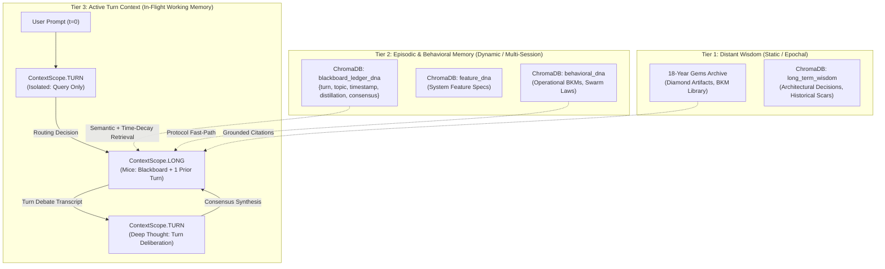
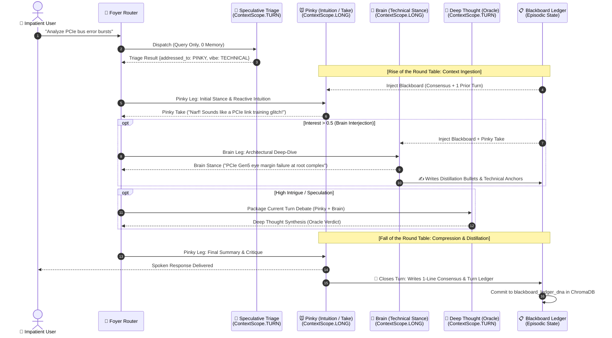

# 🗺️ Context & Memory Flow Diagram Map
**Architecture Anchor:** `[LAB-523]` / `[BKM-050]`  
**Domain:** Bicameral Cognitive Hub, Context Scoping & Multi-Tier Memory RAG  

---

## 1. Global Memory Hierarchy



---

## 2. The Interest Cycle: Rise, Deliberation & Distillation



---

## 3. Scoping & Memory Contract Matrix

| Actor / Component | Context Scope | Ingested Memory | Generated Output | Write Target |
| :--- | :--- | :--- | :--- | :--- |
| **Triage** | `ContextScope.TURN` | Fresh Query Only ($< 200$ tokens). Zero previous debate. | Routing JSON (`vibe`, `addressed_to`, `importance`). | Foyer Router |
| **Pinky (Initial)** | `ContextScope.LONG` | Blackboard (Consensus summary) + Last 1 Turn. | Reactive intuition / fast-path answer. | Foyer UI Stream |
| **Brain** | `ContextScope.LONG` | Blackboard + Pinky Initial Take + ChromaDB Gems/Wisdom. | Technical analysis + Distillation bullets. | **Blackboard Ledger** |
| **Deep Thought** | `ContextScope.TURN` | Current Turn Package only (User query + Pinky take + Brain stance). | Speculative synthesis / oracle verdict. | Foyer UI Stream |
| **Pinky (Judge)** | `ContextScope.LONG` | Brain Stance + Deep Thought Verdict + User Query. | Final spoken dialogue + 1-line consensus. | **ChromaDB Blackboard DNA** |

---

## 4. Blackboard Ledger DNA Schema

Stored in ChromaDB collection `blackboard_ledger_dna`:
```json
{
  "turn_number": 42,
  "timestamp": 1788373200,
  "iso_time": "2026-09-02T13:15:00-07:00",
  "topic": "PCIe Gen5 Link Degradation",
  "actors_involved": ["pinky", "brain", "deep_thought"],
  "distillation_bullets": [
    "Eye margin reduction on Lane 4 during thermal burst",
    "Root complex bifurcation set to x8/x8",
    "Retimer firmware re-flash recommended"
  ],
  "consensus_1liner": "Link retraining instability caused by marginal signal-to-noise ratio at 32 GT/s."
}
```
