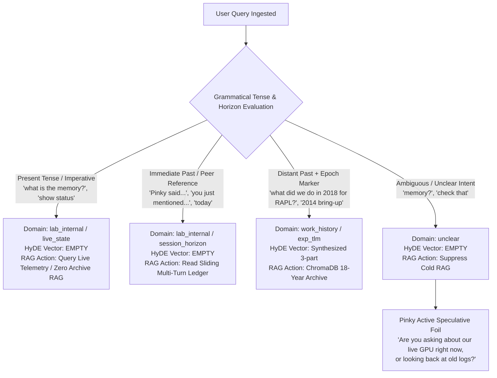

# 📐 Architectural Proposal: Tense-Aware Triage Flowchart & Pinky Speculative Domain Foil

**Author:** Antigravity / Acme Lab Orchestrator  
**Date:** September 5, 2026  
**Status:** PROPOSAL & PRE-WORK (Sprint 74.6 Candidate)  
**Target Submodules:** [`HomeLabAI/src/logic/triage_engine.py`](file:///home/jallred/Dev_Lab/HomeLabAI/src/logic/triage_engine.py), [`HomeLabAI/src/logic/cognitive_hub.py`](file:///home/jallred/Dev_Lab/HomeLabAI/src/logic/cognitive_hub.py)  
**Relevant Features & BKMs:** `FEAT-467`, `FEAT-474`, `FEAT-484`, `FEAT-489`, `BKM-004`, `BKM-035`

---

## 🧭 1. Executive Summary & Problem Statement

In multi-agent architectures running small 3B base models on local silicon (RTX 2080 Ti), **Triage is the supreme steering rudder**. Every downstream token, RAG retrieval query, and persona behavioral stance depends on the initial pre-reflection classification.

### The Problem
When a user asks:
> *"What does the memory look like?"* or *"What discrepancy in Pinky are you talking about?"*

A purely lexical or flat-semantic triage model often snaps to `domain: historical` / `work_history` due to words like *"discrepancy"*, *"memory"*, or references to past conversation turns. This triggers **cold RAG against the 18-year Intel archive (2005–2024)**, surfacing irrelevant 2014 OOM kernel panics (`0x80000009`) or PECI/MSR registers into casual lab conversation.

### The Solution
1. **Tense & Temporal Horizon Flowchart**: Equip Triage with explicit grammatical tense and conversational horizon rules to differentiate **Live State** vs. **Immediate Multi-Turn Horizon** vs. **Distant Historical Eras**.
2. **"Domain Unclear & Fill-In Later" Protocol**: Allow Triage to output `domain: "unclear"` with `hyde_vector_text: ""`, cleanly bypassing premature cold RAG.
3. **Pinky as the Speculative Domain Foil**: When Triage confidence is ambiguous, Pinky conversationally clarifies or speculates out loud, dynamically steering Brain's context without blocking latency.

---

## ⏱️ 2. Latency Budget & The "Think Longer" Trade-Off

Letting Triage "think a little longer" to follow a structured decision tree has negligible perceived cost on our hardware:

| Component | Current Metric | Flowchart-Enhanced Metric | Delta / Impact |
| :--- | :--- | :--- | :--- |
| **Triage Generation Length** | $\sim 40\text{ tokens}$ | $\sim 65\text{ tokens}$ | $+25\text{ tokens}$ ($\approx 480\text{ ms}$) |
| **vLLM Multi-LoRA Batching** | Continuous Batching | Continuous Batching | Zero kernel serialization penalty |
| **RAG Retrieval Overhead** | Fired on all non-casual turns ($\approx 350\text{ ms}$) | **Skipped on `unclear` / live turns** | **Saved $\approx 350\text{ ms}$** on ambiguous turns |
| **Net Perceived Latency** | Baseline | **$-130\text{ ms}$ to $+150\text{ ms}$** | **Net neutral; massive precision gain** |

> [!TIP]
> Spending 480ms on high-fidelity Triage prevents 10+ seconds of wasted deep-thought hallucination and user correction cycles.

---

## 🌳 3. The Tense & Horizon Decision Flowchart



---

## 🧩 4. Architectural Pillars in Detail

### Pillar A: Tense as the Root-Cause Discriminator
Instead of fragile keyword lists, Triage is instructed to evaluate the verb tense and temporal horizon:

1. **Present Tense / Imperative**: Queries asking about the current condition of the lab, models, or hardware (`is`, `are`, `what's`, `show`, `status`).
   - *Target Domain:* `lab_internal`
   - *RAG Action:* Zero archive retrieval.
2. **Immediate Conversational Horizon**: Queries referencing personas in the room (*"Brain"*, *"Pinky"*, *"Jason"*), recent comments (*"what did you mean?"*, *"discrepancy"*), or events from today.
   - *Target Domain:* `lab_internal`
   - *RAG Action:* Bound strictly to `self.round_table_memory` and `journal_ledger.jsonl`.
3. **Distant Historical Horizon**: Queries explicitly referencing past calendar years (2005–2024), former corporate platforms, or historical silicon validation eras.
   - *Target Domain:* `work_history` / `exp_tlm` / `exp_bkm` / `exp_for`
   - *RAG Action:* Synthesize HyDE vector and query ChromaDB.

---

### Pillar B: The "Domain Unclear & Fill-In Later" Protocol
Currently, if Triage cannot classify a query with certainty, it defaults to `domain: standard` or guesses `historical`, inadvertently triggering cold RAG.

Under the new protocol:
* Triage schema explicitly permits `"domain": "unclear"`.
* When `domain == "unclear"`:
  ```python
  if t_parsed.get("domain") == "unclear" or not t_parsed.get("hyde_vector_text"):
      # Suppress cold 18-year archive retrieval
      rag_context = ""
  ```
* This prevents any hallucinatory GEMs from reaching Brain or Pinky.

---

### Pillar C: Pinky as the Speculative Domain Foil
When Triage marks a turn as `domain: "unclear"`, Pinky's behavioral guidance dynamically adapts to act as a **Conversational Clarifier**:

```python
if t_parsed.get("domain") == "unclear":
    behavioral_guidance = (
        "[MODE]: SPECULATIVE_FOIL (Triage intent is ambiguous. "
        "Do NOT guess or fabricate historical facts. "
        "Deliver a playful, in-character 1-sentence quip that poses the likely options, "
        "e.g., 'Are we checking our live GPU vitals right now, or looking back at old test logs?')"
    )
```

1. Pinky streams this speculative clarifying sentence to the Left Console (`channel: pinky`).
2. The turn is recorded into `self.round_table_memory`.
3. The user's next utterance naturally resolves the ambiguity without friction.

---

## 🛠️ 5. Implementation Roadmap (Sprint 74.6)

### Stage 1: Triage Engine Prompt & Schema Expansion
* **Target File:** [`HomeLabAI/src/logic/triage_engine.py`](file:///home/jallred/Dev_Lab/HomeLabAI/src/logic/triage_engine.py)
* **Changes:**
  1. Add the **Tense & Temporal Horizon Rules** to `_build_triage_mode_context()`.
  2. Update schema enum for `domain` to include `["exp_tlm", "exp_bkm", "exp_for", "lab_history", "lab_internal", "feedback", "unclear"]`.

### Stage 2: CognitiveHub RAG & Steering Routing
* **Target File:** [`HomeLabAI/src/logic/cognitive_hub.py`](file:///home/jallred/Dev_Lab/HomeLabAI/src/logic/cognitive_hub.py)
* **Changes:**
  1. Update `_fetch_rag_context` to bypass ChromaDB whenever `domain == "unclear"` or `domain == "lab_internal"`.
  2. Wire `SPECULATIVE_FOIL` behavioral guidance to Pinky when `domain == "unclear"`.

### Stage 3: Verification & Unit Test Suite
* **Target File:** [`HomeLabAI/src/tests/test_feedback_semantic_triage.py`](file:///home/jallred/Dev_Lab/HomeLabAI/src/tests/test_feedback_semantic_triage.py)
* **Test Cases:**
  - `test_present_tense_routes_to_lab_internal_without_rag()`
  - `test_immediate_horizon_peer_reference_routes_to_lab_internal()`
  - `test_ambiguous_query_routes_to_unclear_and_suppresses_rag()`
  - `test_explicit_historical_year_routes_to_archive_rag()`

---

## 📜 6. Summary Matrix

| Scenario | User Query Example | Triage Output (`domain` / `hyde`) | Action Taken |
| :--- | :--- | :--- | :--- |
| **Live Telemetry** | *"What's the memory look like?"* | `domain: "lab_internal"`, `hyde: ""` | Zero archive RAG; query live vitals |
| **Conversational Horizon** | *"What discrepancy in Pinky did you mean?"* | `domain: "lab_internal"`, `hyde: ""` | Read sliding 3-turn memory; zero archive RAG |
| **Historical Archive** | *"What was the RAPL power cap in 2018?"* | `domain: "exp_tlm"`, `hyde: "[VALIDATION]: RAPL..."` | ChromaDB 18-Year Archive RAG |
| **Ambiguous / Fragment** | *"Wait, check that again"* | `domain: "unclear"`, `hyde: ""` | Suppress RAG; Pinky speculative clarifier |
